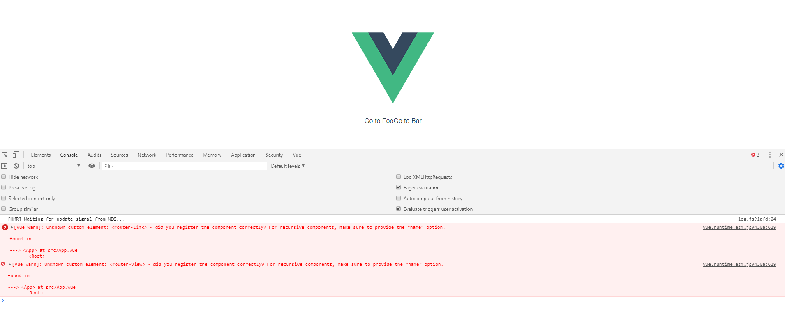
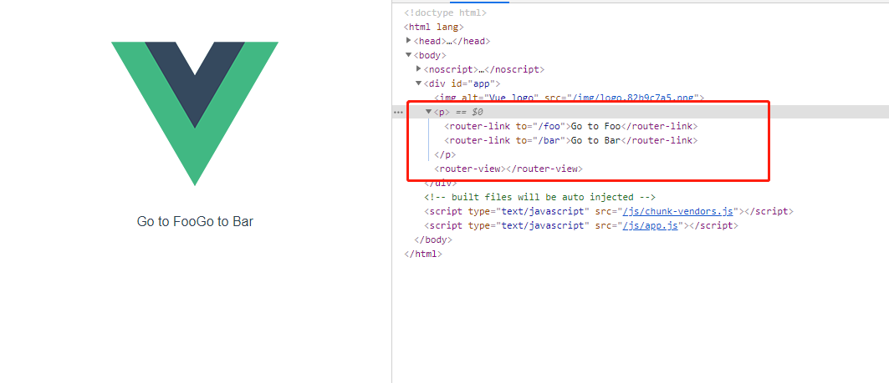

# 手写vue-router源码系列一： 实现 VueRouter｜8月更文挑战

## 前言

前端路由的原理在面试中会经常被问到，经常有些同学会在这里碰壁。本次我将通过几个系列文章的介绍并且手写代码实现来深挖 vue-router 的实现原理，一旦我们掌握了 vue-router 的实现原理，那么我们无论在平时的开发中还是出去面试都会更加游刃有余！

## SPA(Single Page Application)的原理

在单页应用 SPA(Single Page Application)中，路由其实描述的是 URL 与 UI 之间的映射关系，即 URL 变化引起 UI 更新，并且整个过程无需刷新页面（如德芙一样丝滑的体验）。

## vue-router的使用及原理介绍

首先我们回顾下 vue-router 的使用过程

1. 引入 vue-router 并使用 Vue.use()

```js
import VueRouter from 'vue-router'
Vue.use(VueRouter)
```
Vue 是一套用于构建用户界面的渐进式框架，它的核心功能只是解决视图渲染。在 Vue.js 应用构建前端路由的功能就需要借助插件的方式来实现。Vue 的插件注册也很简单，如果插件是一个对象，必须提供 install 方法。如果插件是一个函数，它会被作为 install 方法。install 方法调用时，会将 Vue 作为参数传入。这样的好处就是开发插件的作者不需要再额外去 import Vue 了，节省了插件的文件体积。

2. 创建 vueRouter 实例

```js
export default new VueRouter({
  routes,
});
```
VueRouter 是一个类，我们在 new Vue 的时候会把 routes 作为配置 的属性传⼊，这样在 VueRouter 中我们就可以获取到用户的前端路由配置表，进一步做我们想要做的事情。比如构建 URL 与 UI 之间的映射关系，方便我们以后切换路径的时候在页面上渲染不同的内容出来。

3. 在根组件上添加路由实例
   
```js
import router from './router'

new Vue({
 router,
}).$mount("#app");
```

通过 router 配置参数注入路由，从而让整个应用都有路由功能。于是我们可以在任何组件内通过 this.\$router 访问路由器，也可以通过 this.$route 访问当前路由。

4. 添加路由视图

```js
<router-view></router-view>
```

RouterView 渲染路径匹配到的视图组件。RouterView还可以内嵌自己，根据嵌套路径，渲染嵌套组件。

以上介绍了 vue-router 的使用流程和简单的介绍了它的大概原理。接下来我们通过代码与图片的方式着手实现这个 Vue-router。

## 准备工作

1. 使用 vue-cli 创建一个新的项目，我们选择Default vue2的模板。
   
```js 
vue create v-router
```

2. 删除components文件夹。新增views文件夹，并且新建 Bar.vue 文件和 Foo.vue 文件

Bar.vue
```html
<template>
<div>
  <h1>bar</h1>
</div>
</template>

<script>
export default {

}
</script>

<style>

</style>
```

Foo.vue
```html
<template>
  <h1>foo</h1>
</template>

<script>
export default {

}
</script>

<style>

</style>
```

3. 修改App.vue文件

```html

<template>
  <div id="app">
    
    <p>
      <router-link to="/foo">Go to Foo</router-link>
      <router-link to="/bar">Go to Bar</router-link>
    </p>
    <router-view></router-view>
  </div>
</template>

<script>

export default {
  name: 'App',
}
</script>

<style>
#app {
  font-family: Avenir, Helvetica, Arial, sans-serif;
  -webkit-font-smoothing: antialiased;
  -moz-osx-font-smoothing: grayscale;
  text-align: center;
  color: #2c3e50;
  margin-top: 60px;
}
a {
  margin:20px;
}
</style>

```

4. 在src下面新增 vRouter 文件夹，这个文件夹主要用来放我们后续需要实 vue-router 的代码的相关文件。我们在 vRouter 文件夹下新建两个空白的文件：index.js、install.js 

5. 在src下面新增router文件夹，新建一个index.js

```js
import Vue from "vue";
// 引入我们自己的vue-router
import VueRouter from "@/vRouter/";
import Foo from "../views/Foo.vue";
import Bar from "../views/Bar.vue";
Vue.use(VueRouter);

const routes = [
  {
    path: "/foo",
    name: "foo",
    component: Foo,
  },
  {
    path: "/bar",
    name: "bar",
    component: Bar,
  },
];
let router = new VueRouter({
  routes,
});

export default router;

```


6. 修改main.js文件

```js
import Vue from "vue";
import router from "./router/";
import App from "./App.vue";

Vue.config.productionTip = false;

new Vue({
  router,
  render: (h) => h(App),
}).$mount("#app");

```


## 实现 VueRouter.install

前面的准备工作完成以后我们开始来一步步实现 vue-router。前面已经介绍过，Vue.use(VueRouter) 就是我们引入 vue-router 插件的方法。所以我们先来实现一个 install的方法。

我们在 beforeCreate 钩⼦函数执行的时候将 vue-router 注⼊到每⼀个组件中，这样我们在组件中就可以使用这个vue-router。这时候可能会有人问，我们只在根组件中注入了这个vue-router，但是为什么可以在他的子孙组件中获取到它呢？原因是在Vue内部实现initMixin的时候会把要混⼊的对象通过 mergeOption 合并到 Vue 的 options 中，由于每个组件的构造函数都会在 extend 阶段合并 Vue.options 到⾃⾝的 options 中，所以也就相当于每个组件都定义了 mixin 定义的选项。

相关代码在vue源码的 src/core/global-api/mixin.js 中定义：

```js
import { mergeOptions } from '../util/index'

export function initMixin (Vue: GlobalAPI) {
  Vue.mixin = function (mixin: Object) {
    this.options = mergeOptions(this.options, mixin)
    return this
  }
}
```

install.js

```js
export let _Vue;

export function install(Vue) {
  if (install.installed && _Vue === Vue) return;
  //避免重复安装
  install.installed = true;
  //保存vue，因为后面需要使用Vue提供的api
  _Vue = Vue;

  const isDef = (v) => v !== undefined;


  Vue.mixin({
    beforeCreate() {
      if (isDef(this.$options.router)) {
        //将 _routerRoot 设置为自己
        this._routerRoot = this;
        //将VueRouter实例挂载到Vue._router
        this._router = this.$options.router;
        //初始化VueRouter
        this._router.init(this);
        //把_route变成响应式
        Vue.util.defineReactive(this, "_route", this._router.history.current);
      } else {
        this._routerRoot = (this.$parent && this.$parent._routerRoot) || this;
      }
    },
  });

  /**
   * 注意：通过Object.defineProperty设置到Vue的原型上可以避免他人无意当中修改掉
   * 通过在Vue的原型上定义了$router、$route之后我们就可以在组件中调用 this.$router 和 this.$route 啦！
   */
  Object.defineProperty(Vue.prototype, "$router", {
    get() {
      return this._routerRoot._router;
    },
  });

  Object.defineProperty(Vue.prototype, "$route", {
    get() {
      return this._routerRoot._route;
    },
  });
}

```

然后通过将install方法引入并挂载到 VueRouter 这个类上，这样就实现了插件的 install 方法。

```js
// index.js
import { install } from "./install";

export default class VueRouter {
  constructor(options = {}) {

  }
}
VueRouter.install = install;
```

## 实现 VueRouter

1. 我们在 VueRouter中定义了一些属性，this.app 表⽰根 Vue 实例， this.apps 保存所有⼦组件的 Vue 实例， this.options 保存传⼊的路由配置。 this.mode 表⽰路由创建的模式， this.history 表⽰路由历史的具体的实现实例，它是根据 this.mode 实现不同的路由模式，它有 History 基类，然后不同的 history 实现都是继承 History。

```js
// index.js
import { install } from "./install";
import { HashHistory } from "./history/hash";

export default class VueRouter {
  constructor(options = {}) {
    //获取用户传入的配置
    this.options = options;
    // this.app 表⽰根 Vue 实例
    this.app = null;
    //this.apps 保存所有⼦组件的 Vue 实例
    this.apps = []; 
    this.mode = options.mode || "hash";
    //实现不同模式下的前端路由
    switch (this.mode) {
      case "hash":
        this.history = new HashHistory(this, options.base);
        break;
      default:
        return new Error(`invalid mode: ${this.mode}`);
    }
  }
}
VueRouter.install = install;
```

2. 实例化 VueRouter 后会得到它的实例 router ，我们在使用 new Vue 的时候会把 router 作为 Vue.options.router 传入。我们在 install 方法添加一行代码用于初始化路由。这样每个组件在执⾏ beforeCreated 钩⼦函数的时候都会执⾏ router.init ⽅法。init方法中会用到history.transitionTo 做路由过渡，切换 URL 的时候也会执行它。并且我们还定义setupListeners 方法，如果用户使用的是hash模式的话，它会监听"popstate"、"hashchange"事件并且执行路由过渡。如果用户使用的是history模式的话，它会监听 URL 的变化并且执行路由过渡。

```js
// install.js

export let _Vue;

export function install(Vue) {
  if (install.installed && _Vue === Vue) return;
  //避免重复安装
  install.installed = true;
  //保存vue，因为后面需要使用Vue提供的api
  _Vue = Vue;

  const isDef = (v) => v !== undefined;

  Vue.mixin({
    beforeCreate() {
      if (isDef(this.$options.router)) {
        //将 _routerRoot 设置为自己
        this._routerRoot = this;
        //将VueRouter实例挂载到Vue._router
        this._router = this.$options.router;
        //新增的代码
        this._router.init(this);
      } else {
        this._routerRoot = (this.$parent && this.$parent._routerRoot) || this;
      }
    },
  });
  
  /**
   * 注意：通过Object.defineProperty设置到Vue的原型上可以避免他人无意当中修改掉
   * 通过在Vue的原型上定义了$router、$route之后我们就可以在组件中调用 this.$router 和 this.$route 啦！
   */
  Object.defineProperty(Vue.prototype, "$router", {
    get() {
      return this._routerRoot._router;
    },
  });

  Object.defineProperty(Vue.prototype, "$route", {
    get() {
      return this._routerRoot._route;
    },
  });
}
```

继续完善 VueRouter.init() 

```js
// index.js
import { install } from "./install";

export default class VueRouter {
  constructor(options = {}) {
    //获取用户传入的配置
    this.options = options;
    // this.app 表⽰根 Vue 实例
    this.app = null;
    //this.apps 保存所有⼦组件的 Vue 实例
    this.apps = []; 
    this.mode = options.mode || "hash";
    //实现不同模式下的前端路由
    switch (this.mode) {
      case "hash":
        this.history = new HashHistory(this, options.base);
        break;
      default:
        return new Error(`invalid mode: ${this.mode}`);
    }
  }

  init(app) {
    this.apps.push(app);
    // 只有根Vue实例会保存到this.app
    if (this.app) {
      return;
    }
    //保存 Vue 实例
    this.app = app;

    const history = this.history;
    if (history instanceof HashHistory) {
      //添加路由事件监听函数
      const setupListeners = () => {
        history.setupListeners();
      };
      //执行路由过渡
      history.transitionTo(
        history.getCurrentLocation(),
        setupListeners
      );
    }
  }
}
VueRouter.install = install;
```

## 实现 hash 模式

1. 我们在vRouter文件夹下新建history文件夹，然后新建hash.js。HashHistory 继承自 History。

src/vRouter/history/hash.js
```js
import { History } from "./base";
import { pushState, replaceState, supportsPushState } from "../util/push-state";

export class HashHistory extends History {
  constructor(router, base) {
    super(router, base);
  }

  setupListeners() {
    /**
     * 监听浏览器前进、后退或者 hashchange 事件并且执行路由过渡
     */
    const handleRoutingEvent = () => {
      this.transitionTo(
        getHash(), 
        (route) => {
          if (!supportsPushState) {
            replaceHash(route.fullPath);
          }
        }
      );
    };
    const eventType = supportsPushState ? "popstate" : "hashchange";
    window.addEventListener(eventType, handleRoutingEvent);
  }
}

export function getHash() {
  let href = window.location.href;
  const index = href.indexOf("#");
  if (index < 0) return "";
  href = href.slice(index + 1);
  return href;
}

function replaceHash (path) {
  if (supportsPushState) {
    replaceState(getUrl(path))
  } else {
    window.location.replace(getUrl(path))
  }
}

function getUrl (path) {
  const href = window.location.href
  const i = href.indexOf('#')
  const base = i >= 0 ? href.slice(0, i) : href
  return `${base}#${path}`
}
```

2. 在vRouter中新建util文件夹，新建push-state.js

src/vRouter/util/push-state.js
```js
export const supportsPushState = window.history && typeof window.history.pushState === "function";

export function pushState(url, replace) {
  const history = window.history;
  try {
    if (replace) {
      history.replaceState({}, "", url);
    } else {
      history.pushState({}, "", url);
    }
  } catch (e) {
    window.location[replace ? "replace" : "assign"](url);
  }
}

export function replaceState(url) {
  pushState(url, true);
}

```

3. 实现 History

  History 是 VueRouter 的基类。History 实现了：
- updateRoute (更新路由和视图)
- transitionTo (路由切换)
- listen （保存一些回调函数）

src/vRouter/history/base.js
```js
import { START } from "../util/route";
import { inBrowser } from "../util/dom";

export class History {
  constructor(router, base) {
    // 应用的基路径。例如，如果整个单页应用服务在 /app/ 下，然后 base 就应该设为 "/app/"。
    this.base = normalizeBase(base);
    this.router = router; //保存router实列
    this.current = START;
  }

  listen(cb) {
    //保存将来供 History 调用的方法
    this.cb = cb;
  }

  updateRoute(route) {
    this.current = route;
    this.cb && this.cb();
  }

  transitionTo(location, onComplete) {
    let route = location;
    onComplete && onComplete(route);
  }
}

function normalizeBase(base) {
  if (!base) {
    if (inBrowser) {
      //如果在浏览器环境中会首先查找 <base href="" /> 中的href地址
      const baseEl = document.querySelector("base");
      base = (baseEl && baseEl.getAttribute("href")) || "/";
      //  "https://foo/" >> "/"
      base = base.replace(/^https?:\/\/[^\/]+/, "");
    } else {
      base = "/";
    }
  }
  //确保 base 以 "/" 开头
  if (base.charAt(0) !== "/") {
    base = "/" + base;
  }
  //去掉路径最后的 "/"
  return base.replace(/\/$/, "");
}
```

src/vRouter/util/route.js
```js
/**
 * 此方法返回一个Route对象。
 * 表⽰的是路由中的⼀条线路，它除了描述了类似 Loctaion 的name、 path 、 query 、 hash 、meta这 些概念，
 * 还有 matched 表⽰匹配到的所有的 RouteRecord 。
 * @param {*} record
 * @param {*} location
 * @param {*} redirectedFrom
 * @param {*} router
 * @returns
 */
export function createRoute(record, location, redirectedFrom) {
  //路由记录
  const route = {
    name: location.name || (record && record.name),
    meta: (record && record.meta) || {},
    path: location.path || "/",
    hash: location.hash || "",
    fullPath: getFullPath(location),
    matched: record ? formatMatch(record) : [],
  };
  if (redirectedFrom) {
    route.redirectedFrom = getFullPath(redirectedFrom);
  }
  return Object.freeze(route);
}

// 初始化的route
export const START = createRoute(null, {
  path: "/",
});

function formatMatch(record) {
  const res = [];
  while (record) {
    res.unshift(record);
    record = record.parent;
  }
  return res;
}

function getFullPath({ path, hash = "" }) {
  return (path || "/") + hash;
}

````

v-router/src/vRouter/util/dom.js

```js
export const inBrowser = typeof window !== 'undefined'
```

通过以上步骤我们先运行下代码看看效果：

执行 npm run serve



通过页面我们看到 Vue 给我们报了警告：说我们没有注册过router-link、router-view这两个组件。

再检查页面中的元素可以看到，我们写的 router-link 和 router-view 并没有被浏览器识别出来。因为这个是我们自定义的标签。因此我们需要注册这两个全局组件。比如说让 router-link 渲染成 a 标签，router-view 渲染出我们想要的 UI。




## 下期预告

使用router-link可以实现跳转到指定路由界面,但是我们如何知道哪个 URL 对应的 View 的具体内容是什么呢? 换句话说就是如何将 URL 与 View 关联起来呢?即建立 URL 与 View 的映射关系。如果我们知道了这个对应关系，那么在 URL 变化的时候我们只需要更新对应的视图内容就可以了！这就是 matcher 的用途之一。另外 vue-router 的 matcher 还实现了addRoutes、addRoute、getRoutes等方法。那么下期我们将会介绍如何实现 matcher。敬请期待。。。

## Vue-Router 源码相关系列链接：

- [手写Vue Router源码系列一： 实现 VueRouter](https://juejin.cn/post/6991348164527685640)
- [手写Vue Router源码系列二：实现 matcher](https://juejin.cn/post/6993155485775953951)
- [手写vue-router源码系列三：实现改变hash后更新视图](https://juejin.cn/post/6994722379553308685)