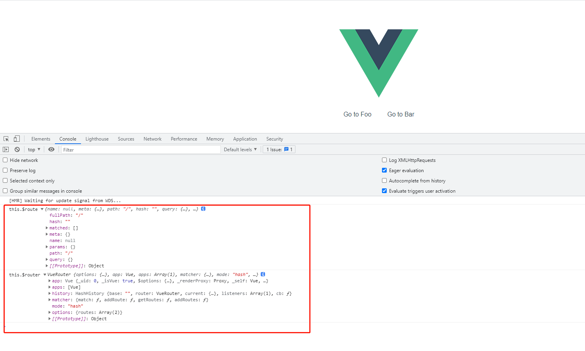
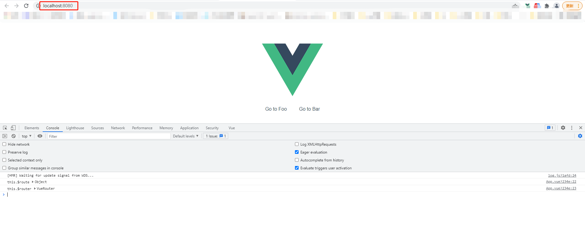
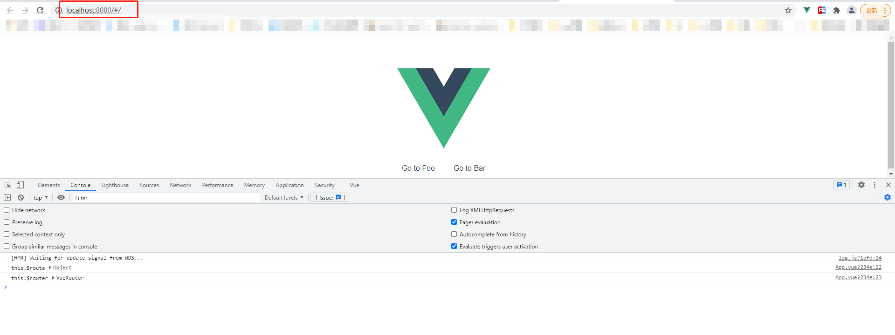

# 手写vue-router源码系列三：实现改变hash后更新视图

这是我参与8月更文挑战的第3天，活动详情查看：[8月更文挑战](https://juejin.cn/post/6987962113788493831)

## 引入RouterLink、RouterView
通过对 match() 方法的实现，我们已经有了从 URL --> View 的一个映射关系。现在我们来实现路由视图的渲染。

接下来我们在 install 方法中引入两个全局的路由组件：RouterLink、RouterView（关于路由的两个全局组件的实现我会在下一篇文章中继续深入讲解）。在 beforeCreate 钩子函数中执行  this._router.init(this)  用于初始化路由配置。

修改下我们的install.js文件：

```js
//  src/vRouter/install.js

//引入路由组件
import View from "./components/view";
import Link from "./components/link";

export let _Vue;

export function install(Vue) {
  if (install.installed && _Vue === Vue) return;
  //避免重复安装
  install.installed = true;
  //保存vue，因为后面需要使用Vue提供的api
  _Vue = Vue;

  const isDef = (v) => v !== undefined;

  Vue.mixin({
    beforeCreate() {
      if (isDef(this.$options.router)) {
        //将 _routerRoot 设置为自己
        this._routerRoot = this;
        //将VueRouter实例挂载到Vue._router
        this._router = this.$options.router;
        //初始化VueRouter
        this._router.init(this);
        //把_route变成响应式
        Vue.util.defineReactive(this, "_route", this._router.history.current);
      } else {
        this._routerRoot = (this.$parent && this.$parent._routerRoot) || this;
      }
    },
  });
  
  /**
   * 注意：通过Object.defineProperty设置到Vue的原型上可以避免他人无意当中修改掉
   * 通过在Vue的原型上定义了$router、$route之后我们就可以在组件中调用 this.$router 和 this.$route 啦！
   */
  Object.defineProperty(Vue.prototype, "$router", {
    get() {
      return this._routerRoot._router;
    },
  });

  Object.defineProperty(Vue.prototype, "$route", {
    get() {
      return this._routerRoot._route;
    },
  });

 //全局注册路由组件
  Vue.component("RouterView", View);
  Vue.component("RouterLink", Link);
}

```
## init()

init 的逻辑很简单，它接收的参数是 Vue 实例，然后存储到 this.apps 中；只有根 Vue 实例才会保存到 this.app 中，然后会根据用户配置的路由 mode 调用 new History的方式实例化一个 History。我们会根据用户传入的 mode 来使用不同的 History，本系列先分析 hash 方式的路由实现。


我们给 VueRouter 类添加一个 init() 方法。
```js
// src/vRouter/index.js

import { createMatcher } from "./create-matcher";
import { install } from "./install";
import { HashHistory } from "./history/hash";

export default class VueRouter {
  constructor(options = {}) {
    //获取用户传入的配置
    this.options = options;
    // this.app 表⽰根 Vue 实例
    this.app = null;
    //this.apps 保存所有⼦组件的 Vue 实例
    this.apps = [];
    //createMatcher函数返回一个对象 {match, addRoutes, getRoutes, addRoutes}
    this.matcher = createMatcher(options.routes || [], this);
    this.mode = options.mode || "hash";
    //实现不同模式下的前端路由
    switch (this.mode) {
      case "hash":
        this.history = new HashHistory(this, options.base);
        break;
      default:
        return new Error(`invalid mode: ${this.mode}`);
    }
  }

  match(raw, current) {
    return this.matcher.match(raw, current);
  }

  init(app) {
    this.apps.push(app);
    // 只有根Vue实例会保存到this.app
    if (this.app) {
      return;
    }
    //保存 Vue 实例
    this.app = app;
    const history = this.history;
    if (history instanceof HashHistory) {
      const setupListeners = () => {
        history.setupListeners();
      };
      //执行路由过渡
      history.transitionTo(history.getCurrentLocation(), setupListeners);
    }

    /**
     * 注册一个函数并且这个函数接收一个 currentRoute 作为参数。
     * 每次切换路由的时候就执行 vue._route = currentRoute 。
     * 这样每个vue组件实例都能拿到currentRoute，并及时更新视图
     */
    history.listen((route) => {
      this.apps.forEach((app) => {
        // 更新app上的_route
        app._route = route;
      });
    });
  }
}

VueRouter.install = install;

```

## transitionTo

transitionTo 接收两个参数。第一个参数是目标路由：location，第二个参数是一个函数，这个函数主要是在 VueRouter 初始化的时候设置一个监听 URL 变化的函数，并且在 URL 变化的时候维护当前 window.history 的历史栈。比如调用 pushState() 向history压入一条历史记录。关于浏览器原生的[History API](https://developer.mozilla.org/zh-CN/docs/Web/API/History_API) 不太熟悉的同学建议先去预习一下。

当我们切换路由的时候，就会执⾏到 transitionTo() 方法。transitionTo() 方法被定义在 History 这个基类上。因此在 init 里面执行 history.transitionTo() 的时候就是执行的 History.transitionTo()


## History

History是所有路由模式的基类，其他的路由模式均扩展自 History。

我们先看看 History 的实现：

```js
//  src\vRouter\history\base.js

import { START } from "../util/route";
import { inBrowser } from "../util/dom";

export class History {
  constructor(router, base) {
    // 应用的基路径。例如，如果整个单页应用服务在 /app/ 下，然后 base 就应该设为 "/app/"。
    this.base = normalizeBase(base);
    this.router = router; //保存router实列
    this.current = START;
    this.listeners = [];
  }

  //保存将来供 History 调用的方法
  listen(cb) {
    this.cb = cb;
  }

  //更新路由视图
  updateRoute(route) {
    this.current = route;
    this.cb && this.cb(route);
  }

  //执行路由切换
  transitionTo(location, onComplete) {
    //计算出目标路由
    const route = this.router.match(location, this.current);
    //更新当前route
    this.updateRoute(route);
    onComplete && onComplete(route);
  }
}

function normalizeBase(base) {
  if (!base) {
    if (inBrowser) {
      //如果在浏览器环境中会首先查找 <base href="" /> 中的href地址
      const baseEl = document.querySelector("base");
      base = (baseEl && baseEl.getAttribute("href")) || "/";
      //  "https://foo/" >> "/"
      base = base.replace(/^https?:\/\/[^\/]+/, "");
    } else {
      base = "/";
    }
  }
  //确保 base 以 "/" 开头
  if (base.charAt(0) !== "/") {
    base = "/" + base;
  }
  //去掉路径最后的 "/"
  return base.replace(/\/$/, "");
}
```

transitionTo() 方法实现非常简单：
1. 通过目标 location 和 this.current 计算出目标路由
2. 调用 this.updateRoute() 更新路由视图，并且通过调用this.cb(route)更新app._route。
3. 调用 onComplete() 维护 window.history 

## HashHistory

其实在 [手写Vue Router源码系列一： 实现 Vue Router](https://juejin.cn/post/6991348164527685640#heading-6) 文中我们实现了 HashHistory。

我们现在对其优化下：

```js
// src\vRouter\history\hash.js

import { History } from "./base";
import { pushState, replaceState, supportsPushState } from "../util/push-state";

export class HashHistory extends History {
  constructor(router, base) {
    super(router, base);
  }

  setupListeners() {
    //避免重复监听
    if (this.listeners.length > 0) {
      return;
    }
    /**
     * 监听浏览器前进、后退或者 hashchange 事件并且维护history对象
     */
    const handleRoutingEvent = () => {
      this.transitionTo(getHash(), (route) => {
        if (!supportsPushState) {
          replaceHash(route.fullPath);
        }
      });
    };
    const eventType = supportsPushState ? "popstate" : "hashchange";
    window.addEventListener(eventType, handleRoutingEvent);
    //有事件监听必须要有取消监听
    this.listeners.push(() => {
      window.removeEventListener(eventType, handleRoutingEvent);
    });
  }

  getCurrentLocation() {
    return getHash();
  }
}

export function getHash() {
  let href = window.location.href;
  const index = href.indexOf("#");
  if (index < 0) return "";
  href = href.slice(index + 1);
  return href;
}

// path = "/"
function replaceHash(path) {
  if (supportsPushState) {
    replaceState(getUrl(path));
  } else {
    window.location.replace(getUrl(path));
  }
}

function getUrl(path) {
  const href = window.location.href;
  const i = href.indexOf("#");
  const base = i >= 0 ? href.slice(0, i) : href;
  //这就是为什么当我们启动本地开发服务器的时候打开的页面会默认加上hash => http://192.168.35.118:8080/#/
  return `${base}#${path}`;
}

```

setupListeners 函数中定义了一个 handleRoutingEvent 函数用于监听 popstate 或者 hashchange 事件并且维护 history 对象。在路由初始化的时候会将 setupListeners 作为 history.transitionTo() 的第二个参数传入。这样在执行路由路径切换的同时，还维护了 history的历史栈。其实源码中还实现了记录滚动条的位置的功能，感兴趣的同学建议阅读下源码。

## 演示

通过前面2个系列的准备工作，我们现在可以来运行代码看看效果。

先在 App.vue 中打印看看能否在组件中通过 this.$route 和 this.$router 的方式访问。

```vue
<template>
  <div id="app">
    
    <p>
      <router-link to="/foo">Go to Foo</router-link>
      <router-link to="/bar">Go to Bar</router-link>
    </p>
    <router-view></router-view>
  </div>
</template>

<script>

export default {
  name: 'App',
  mounted() {
    console.log('this.$route', this.$route)
    console.log('this.$router', this.$router)
  }
}
</script>

<style>
#app {
  font-family: Avenir, Helvetica, Arial, sans-serif;
  -webkit-font-smoothing: antialiased;
  -moz-osx-font-smoothing: grayscale;
  text-align: center;
  color: #2c3e50;
  margin-top: 60px;
}
a {
  margin:20px;
}
</style>

```

然后运行： npm run serve 看看：



现在我们可以通过 this.$route 访问到当前激活的路由的状态信息，包含了当前 URL 解析得到的信息，还有 URL 匹配到的路由记录 (route records)。

通过 this.$router 访问到当前 VueRouter 实例。

## 思考一个问题

我们平时在使⽤ Vue-Router 开发项⽬的时候，打开调试⻚⾯ http://localhost:8080/ 后会⾃动把 url 修改为 http://localhost:8080/#/ ，这是怎么做到呢？

我们目前的页面打开的 url 是这样的： http://localhost:8080



## 实现默认的 hash 的功能

我们在初始化 HashHistory 的时候添加一个 ensureSlash() 

```js


import { History } from "./base";
import { pushState, replaceState, supportsPushState } from "../util/push-state";

export class HashHistory extends History {
  constructor(router, base) {
    super(router, base);
    //新增的代码
    ensureSlash();
  }

  setupListeners() {
    //避免重复监听
    if (this.listeners.length > 0) {
      return;
    }
    /**
     * 监听浏览器前进、后退或者 hashchange 事件并且维护history对象
     */
    const handleRoutingEvent = () => {
      this.transitionTo(getHash(), (route) => {
        if (!supportsPushState) {
          replaceHash(route.fullPath);
        }
      });
    };
    const eventType = supportsPushState ? "popstate" : "hashchange";
    window.addEventListener(eventType, handleRoutingEvent);
    //有事件监听必须要有取消监听
    this.listeners.push(() => {
      window.removeEventListener(eventType, handleRoutingEvent);
    });
  }

  getCurrentLocation() {
    return getHash();
  }
}

function pushHash(path) {
  if (supportsPushState) {
    pushState(getUrl(path));
  } else {
    window.location.hash = path;
  }
}

export function getHash() {
  let href = window.location.href;
  const index = href.indexOf("#");
  if (index < 0) return "";
  href = href.slice(index + 1);
  return href;
}

// path = "/"
function replaceHash(path) {
  if (supportsPushState) {
    replaceState(getUrl(path));
  } else {
    window.location.replace(getUrl(path));
  }
}

function getUrl(path) {
  const href = window.location.href;
  const i = href.indexOf("#");
  const base = i >= 0 ? href.slice(0, i) : href;
  //这就是为什么当我们启动本地开发服务器的时候打开的页面会默认加上hash => http://192.168.35.118:8080/#/
  return `${base}#${path}`;
}

function ensureSlash() {
  const path = getHash();
  if (path.charAt(0) === "/") {
    return true;
  }
  replaceHash("/" + path);
  return false;
}

```

执行 ensureSlash() 的时候首先会先去获取 URL 中的 hash。显然在 “http://localhost:8080/” 中执行 getHash() 返回的是空字符串，因此还会调用 replaceHash("/" + path) 方法。最后我们的路径就变成了 “http://localhost:8080/#/”

执行 npm run serve 看看效果：



这样默认的 hash 就实现了！

## 下期预告

下个系列将会带大家探索手写实现全局组件 router-link、router-view。敬请期待!

## Vue-Router 源码相关系列链接：

- [手写Vue Router源码系列一： 实现 VueRouter](https://juejin.cn/post/6991348164527685640)
- [手写Vue Router源码系列二：实现 matcher](https://juejin.cn/post/6993155485775953951)
- [手写vue-router源码系列三：实现改变hash后更新视图](https://juejin.cn/post/6994722379553308685)