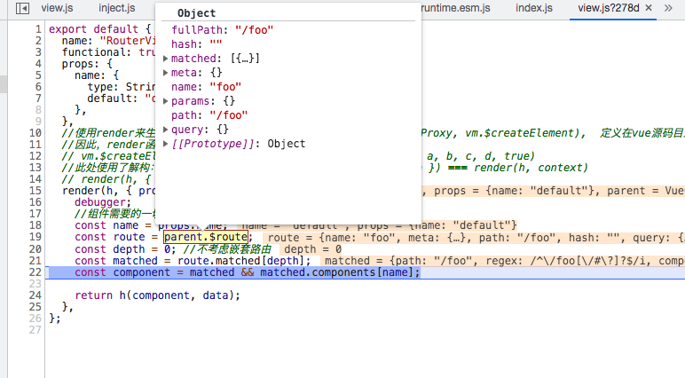
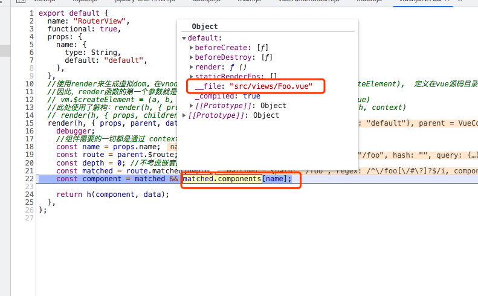
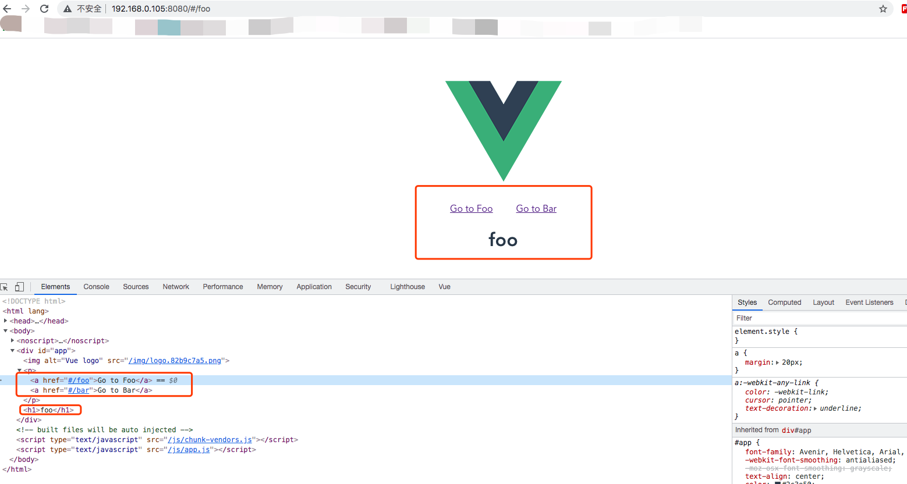

# 手写vue-router源码系列四：实现全局组件 router-link、router-view

这是我参与8月更文挑战的第4天，活动详情查看：[8月更文挑战](https://juejin.cn/post/6987962113788493831)

tips：接下来的内容涉及到函数式组件和渲染函数，建议不太熟悉的同学可以先看看官方文档 [函数式组件](https://cn.vuejs.org/v2/guide/render-function.html#%E5%87%BD%E6%95%B0%E5%BC%8F%E7%BB%84%E4%BB%B6) 、[渲染函数](https://cn.vuejs.org/v2/guide/render-function.html)

我们在 vRouter 目录下新建 components 目录并新建 link.js 和 view.js。

## RouterLink

```js
// src/vRouter/components/link.js

export default {
  name: "RouterLink",
  props: {
    //表示目标路由的链接。当被点击后，内部会立刻把 to 的值传到 router.push()，所以这个值可以是一个字符串或者是描述目标位置的对象。
    to: {
      type: [String, Object],
      required: true,
    },
    tag: {
      type: String,
      default: "a",
    },
    event: {
      type: String,
      default: "click",
    },
    //设置 append 属性后，则在当前 (相对) 路径前添加基路径。例如，我们从 /a 导航到一个相对路径 b，如果没有配置 append，则路径为 /b，如果配了，则为 /a/b
    append: {
      type: Boolean,
      default: false,
    },
  },
  render(h) {
    const router = this.$router
    const current = this.$route
    //通过Vue-router的resolve方法拿到目标 location和href
    const { location, href } = router.resolve(
      this.to,
      current,
      this.append
    );
    
    //重新覆写 router-link 组件的点击事件
    const handler = (e) => {
      if (guardEvent(e)) {
        if (this.replace) {
          router.replace(location)
        } else {
          router.push(location)
        }
      }
    };

    const on = { 
      click: guardEvent,
      [this.event] : handler,
    }

    const data = {}

    if (this.tag === "a") {
      data.on = on;
      data.attrs = { href };
    } else {
      //todo else
    }
    return h(this.tag, data, this.$slots.default);
  },
};

//设置一个点击事件的守卫用来取消点击事件的执行
function guardEvent(e) {
  if (e.preventDefault) {
    e.preventDefault();
  }
  return true;
}

```
解释一下 render方法里面的代码：

由于我们在注册插件的时候（install.js）在Vue.prototype上设置了 \$router 和 \$route,所以我们在组件内部可以通过 this.\$router 和 this.\$route 的方式拿到路由实例和当前的路由对象。

拿到 router 实例以后我们通过 router.resolve() 方法解析出当前的location对象以及href的属性。最后通过渲染函数生成一个 &lt;a&gt; 标签。并且在 &lt;a&gt; 标签上设置 href属性。

这里需要注意的是，我们必须阻止 &lt;a&gt; 标签的点击事件行为，因此我定义了一个 guardEvent() 方法。并且通过 vue-router 对象提供的 push、replace等方法来使用导航，其内部还是使用了window.history.pushState方法（如果浏览器不支持的话则设置window.location.hash）。

当然，源码中还涉及到组件的默认样式处理。感兴趣的同学可以自行研究。


## render方法的context参数
函数式组件也称**无状态组件**，也没有生命周期方法。实际上，它只是一个接受一些 prop 的函数。组件需要的一切都是通过 context 参数传递，它是一个包含了如下关键字段的对象（未全部列出）：

- props：提供所有 prop 的对象
- children：VNode 子节点的数组
- slots：一个函数，返回了包含所有插槽的对象
- data：传递给组件的整个数据对象，作为 createElement 的第二个参数传入组件
- parent：对父组件的引用

下面我们继续看看如何实现 RouterView

## RouterView

```js
// src/vRouter/components/view.js

export default {
  name: "RouterView",
  functional: true,
  props: {
    name: {
      type: String,
      default: "default",
    },
  },
  //使用render来生成虚拟dom。在vnode = render.call(vm._renderProxy, vm.$createElement),  定义在vue源码目录： src/core/instance/render.js
  //因此，render函数的第一个参数就是createElement函数（h）
  // vm.$createElement = (a, b, c, d) => createElement(vm, a, b, c, d, true)
  //此处使用了解构：render(h, { props, children, parent, data }) === render(h, context)
  // render(h, { props, children, parent, data }) {
  render(h, { props, parent, data }) {
    //组件需要的一切都是通过 context 参数传递
    const name = props.name;
    const route = parent.$route;
    const depth = 0; //不考虑嵌套路由
    const matched = route.matched[depth];
    const component = matched && matched.components[name];

    return h(component, data);
  },
};


```

由于 RouterView 需要知道当前 location 对应的视图内容和拥有更新视图的能力。我们在render方法中使用了第二个参数 **context**。

借助context对象我们有了访问到父组件的状态信息的能力。我们来分析下render函数执行的过程：
1. 通过props.name可以获取到父组件传过来的组件name（默认：default）。
2. 通过parent.\$route可以获取到父组件的route对象。（图一）
3. route对象上的matched数组存了匹配到的路由组件信息，通过它匹配到我们定义的组件内容。（图二）
4. 拿到组件内容并且通过createElment方法生成一个虚拟DOM并最终通过Vue渲染出真实的dom。

到此我们的两个全局的路由组件就写好了。

图一：



图二：



## 给 vue-router 对象添加 push、replace、resolve方法

继续完善 vue-router：

```js
//  src/vRouter/index.js

import { cleanPath } from "./util/path";
import { createMatcher } from "./create-matcher";
import { install } from "./install";
import { HashHistory } from "./history/hash";
import { normalizeLocation } from "./util/location";

export default class VueRouter {
  constructor(options = {}) {
    //获取用户传入的配置
    this.options = options;
    // this.app 表⽰根 Vue 实例
    this.app = null;
    //this.apps 保存所有⼦组件的 Vue 实例
    this.apps = [];
    //createMatcher函数返回一个对象 {match, addRoutes, getRoutes, addRoutes}
    this.matcher = createMatcher(options.routes || [], this);
    this.mode = options.mode || "hash";
    //实现不同模式下的前端路由
    switch (this.mode) {
      case "hash":
        this.history = new HashHistory(this, options.base);
        break;
      default:
        return new Error(`invalid mode: ${this.mode}`);
    }
  }

  match(raw, current) {
    return this.matcher.match(raw, current);
  }

  push(location, onComplete) {
    this.history.push(location, onComplete);
  }

  replace(location, onComplete) {
    this.history.replace(location, onComplete);
  }

  init(app) {
    this.apps.push(app);
    // 只有根Vue实例会保存到this.app
    if (this.app) {
      return;
    }
    //保存 Vue 实例
    this.app = app;
    const history = this.history;
    if (history instanceof HashHistory) {
      //添加路由事件监听函数
      const setupListeners = () => {
        history.setupListeners();
      };
      //执行路由过渡
      history.transitionTo(history.getCurrentLocation(), setupListeners);
    }

    /**
     * 注册一个函数并且这个函数接收一个 currentRoute 作为参数。
     * 每次切换路由的时候就执行 vue._route = currentRoute 。
     * 这样每个vue组件实例都能拿到currentRoute，并及时更新视图
     */
    history.listen((route) => {
      this.apps.forEach((app) => {
        // 更新app上的_route
        app._route = route;
      });
    });
  }

 //解析路由
  resolve(to, current, append) {
    current = current || this.history.current;
    const location = normalizeLocation(to, current, append, this);
    const route = this.match(location, current);
    const fullPath = route.redirectedFrom || route.fullPath;
    const base = this.history.base;
    const href = createHref(base, fullPath, this.mode);
    return {
      location,
      route,
      href,
      normalizedTo: location,
      resolved: route,
    };
  }
}

function createHref(base, fullPath, mode) {
  var path = mode === "hash" ? "#" + fullPath : fullPath;
  return base ? cleanPath(base + "/" + path) : path;
}

VueRouter.install = install;

```

resolve() 方法主要用于解析路由。它接收三个参数：

- to：表示目标路由的链接。当被点击后，内部会立刻把 to 的值传到 router.push()，所以这个值可以是一个字符串或者是描述目标位置的对象。
- current：代表当前路由对象
- append：设置 append 属性后，则在当前 (相对) 路径前添加基路径。例如，我们从 /a 导航到一个相对路径 b，如果没有配置 append，则路径为 /b，如果配了，则为 /a/b

## 完善hash.js

vue-router的hash模式继承自 Hash 类。
```js
// src/vRouter/history/hash.js

import { History } from "./base";
import { pushState, replaceState, supportsPushState } from "../util/push-state";

export class HashHistory extends History {
  constructor(router, base) {
    super(router, base);
    ensureSlash();
  }

  setupListeners() {
    //避免重复监听
    if (this.listeners.length > 0) {
      return;
    }
    /**
     * 监听浏览器前进、后退或者 hashchange 事件并且维护history对象
     */
    const handleRoutingEvent = () => {
      this.transitionTo(getHash(), (route) => {
        if (!supportsPushState) {
          replaceHash(route.fullPath);
        }
      });
    };
    const eventType = supportsPushState ? "popstate" : "hashchange";
    window.addEventListener(eventType, handleRoutingEvent);
    //有事件监听必须要有取消监听
    this.listeners.push(() => {
      window.removeEventListener(eventType, handleRoutingEvent);
    });
  }

  push(location, onComplete) {
    this.transitionTo(
      location,
      (route) => {
        pushHash(route.fullPath);
        onComplete && onComplete(route);
      }
    );
  }

  replace(location, onComplete) {
    this.transitionTo(
      location,
      (route) => {
        replaceHash(route.fullPath);
        onComplete && onComplete(route);
      }
    );
  }

  go(n) {
    window.history.go(n);
  }

  getCurrentLocation() {
    return getHash();
  }
}

function pushHash(path) {
  if (supportsPushState) {
    pushState(getUrl(path));
  } else {
    window.location.hash = path;
  }
}

function ensureSlash() {
  const path = getHash();
  if (path.charAt(0) === "/") {
    return true;
  }
  replaceHash("/" + path);
  return false;
}

export function getHash() {
  let href = window.location.href;
  const index = href.indexOf("#");
  if (index < 0) return "";
  href = href.slice(index + 1);
  return href;
}

// path = "/"
function replaceHash(path) {
  if (supportsPushState) {
    replaceState(getUrl(path));
  } else {
    window.location.replace(getUrl(path));
  }
}

function getUrl(path) {
  const href = window.location.href;
  const i = href.indexOf("#");
  const base = i >= 0 ? href.slice(0, i) : href;
  return `${base}#${path}`;
}

```

hash.js在上一个系列： [手写vue-router源码系列三：实现改变hash后更新视图](https://juejin.cn/post/6994722379553308685) 已经详细解析过在此就不重复介绍了，未阅读过的同学建议按顺序阅读。

## 通过&lt;router-link&gt;实现导航

通过运行项目检查元素可以看出，router-link 组件被渲染成了&lt;a&gt;标签, to 属性被设置成了&lt;a&gt;标签的 href 属性值。组件内容也被正确的显示出来。这也就代表我们成功的实现了组件功能。



再来看看动图展示路由切换：


## 下期预告

下个系列将会带大家探索导航守卫是如何实现的！敬请期待。。。
祝天下所有程序员拥有一个浪漫的七夕！哈哈

## Vue-Router 源码相关系列链接：

- [手写Vue Router源码系列一： 实现 VueRouter](https://juejin.cn/post/6991348164527685640)
- [手写Vue Router源码系列二：实现 matcher](https://juejin.cn/post/6993155485775953951)
- [手写vue-router源码系列三：实现改变hash后更新视图](https://juejin.cn/post/6994722379553308685)
- [手写vue-router源码系列四：实现全局组件 router-link、router-view](https://juejin.cn/post/6995956430310211598)

