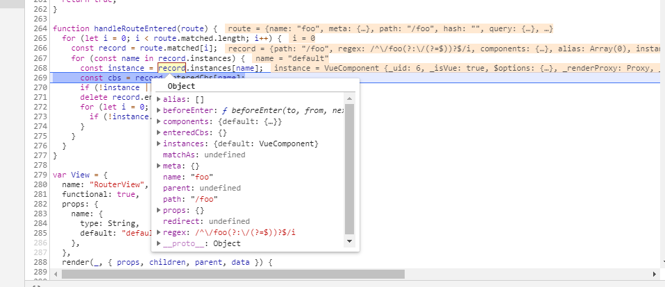
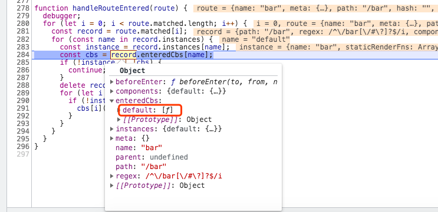
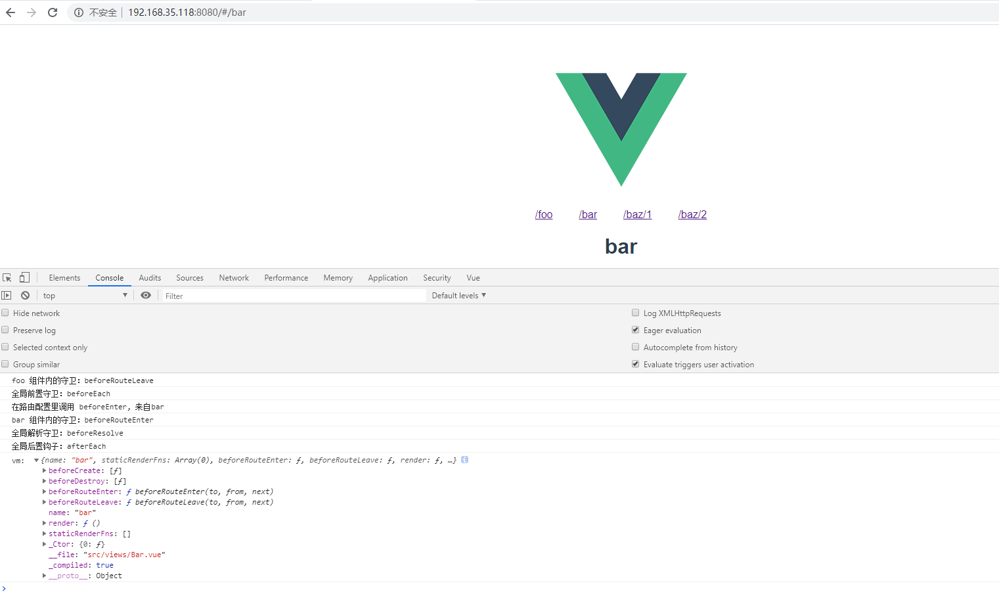
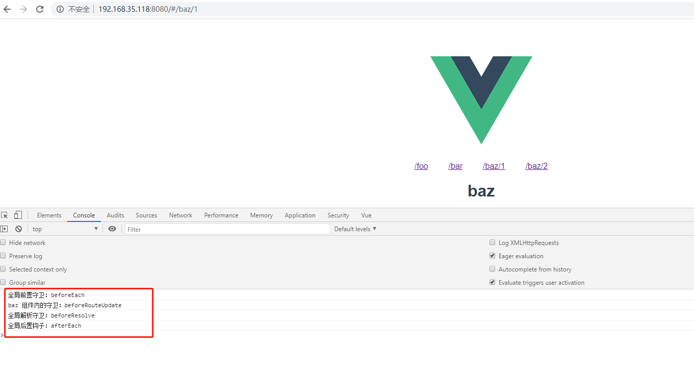

# 手写vue-router源码系列五：实现导航守卫

这是我参与8月更文挑战的第5天，活动详情查看：[8月更文挑战](https://juejin.cn/post/6987962113788493831)

“导航”表示路由正在发生改变。导航守卫实际上就是在发生路由切换时候执行的一系列路由相关的钩子函数。vue-router 提供的导航守卫主要用来通过跳转或取消的方式守卫导航。

## 前言

不知道同学们在使用 vue-router 进行前端路由开发的时候有没有碰到过如下的问题：

- 官方提供导航的守卫那么多，可是当我在两个组件之间切换路由的时候每个导航的调用顺序是怎么样的呢？
- 为什么我需要在每个导航中提供 next 函数来进行到下一个守卫呢？
- 在组件中的守卫: beforeRouteEnter 中如何获取到当前组件实例呢？

相信许多初次使用 vue-router 的同学们都会有刚才的疑惑吧？不过同学们不要慌。我相信通过本系列文章的手写源码实践，我们将会透彻的认识到 vue-router 导航守卫的底层原理。

## vue-router导航守卫

vue-router 总共提供了 **7** 种导航守卫：

| 守卫 | 描述 |
| --- | --- |
| router.beforeEach | 全局前置守卫 |
| router.beforeResolve | 全局解析守卫 |
| router.afterEach | 全局后置钩子 |
| router.beforeEnter | 路由独享的守卫 |
| router.beforeRouteEnter | 组件内的守卫 |
| router.beforeRouteUpdate | 组件内的守卫 |
| router.beforeRouteLeave | 组件内的守卫 |

## 导航流程解析

1. 导航被触发。
2. 在失活的组件里调用 beforeRouteLeave 守卫。
3. 调用全局的 beforeEach 守卫。
4. 在重用的组件里调用 beforeRouteUpdate 守卫。
5. 在路由配置里调用 beforeEnter。
6. 解析异步路由组件。
7. 在被激活的组件里调用 beforeRouteEnter。
8. 调用全局的 beforeResolve 守卫。
9. 导航被确认。
10. 调用全局的 afterEach 钩子。
11. 触发 DOM 更新。
12. 调用 beforeRouteEnter 守卫中传给 next 的回调函数，创建好的组件实例会作为回调函数的参数传入。

以上是官方文档给出的导航流程解析。那么现在我就按照这个流程带同学们实现 vue-router 的进阶部分： vue-router 导航守卫。

## 路由守卫的本质与JavaScript 异步队列实现：queue 函数

在 JavaScript 中异步编程是非常重要的，我们纵观整个vue-router的守卫执行过程其实本质上就是在执行一个异步队列。意识到这一观点对于我们理解路由守卫至关重要。话说回来，如何优雅的实现一个异步队列体现了开发者的技术功底。

那么实现异步队列的方法有很多种：callback，promise，generator，async/await等等这些都可以用来处理异步队列。

比如用promise的话可以这样：

```js
a.then(
  b.then(
    c.then()
  )
)
```
这样的问题是代码嵌套严重，而且只要任务变得多起来，代码就会无限的向右偏移，果断放弃。于是我们想：要是有一个队列可以自己按顺序执行，并且在必要的时候可以终止队列的执行那就好了。我们来看下面的一段代码：

```js
function runQueue(queue, fn, cb) {
  const step = (index) => {
    if (index >= queue.length) {
      cb();
    } else {
      if (queue[index]) {
        fn(queue[index], () => {
          step(index + 1);
        });
      } else {
        step(index + 1);
      }
    }
  };
  step(0);
}
```

我们有一个可以自动执行队列的函数： runQueue。它接收三个参数：
1. queue：队列中的异步任务（或者异步函数）
2. fn：一个迭代器（iterator）。它的的作用是执行队列中的异步函数，并且在执行完异步函数的时候通过回调来进行下一个异步函数。
3. cb： 这个callback函数可以作为辅助来执行一些额外的任务。

在runQueue的内部我们定义了一个step函数。它的作用就是确保在队列中的异步函数可以按照顺序执行。由于我们的导航守卫钩子可以被当做一个异步任务，所以我们可以用它来实现我们的异步队列。

## 实现一个迭代方法： iterator

iterator方法用迭代我们的守卫钩子，例如：

```js
router.beforeEach((to, from, next) => {
  // ...
})
```
所以我们来看看这个 iterator 如何实现：

```js
const iterator = (hook, next) => {
  try {
    //这个地方的hook就相当于我们自己定义的路由守卫： NavigationGuard(to, from, next)
    hook(route, current, (to) => {
        next(to);
    });
  } catch (error) {
    console.log(error);
  }
};
```

iterator函数接收两个参数，并且两个参数都是函数。hook就是我们的守卫钩子，next可以理解为我们进行到下一个钩子的开关。只有在钩子的内部执行了next() 方法异步队列才会继续往下进行。

以上的runQueue和iterator两个方法配合使用就可以让异步队列自动按照我们想要的顺序执行了。因此理解runQueue和iterator两个方法非常重要！

## 改造代码

通过前面的铺垫我们已经理解了路由的本质。那么我们接着上个系列 [手写vue-router源码系列四：实现全局组件 router-link、router-view](https://juejin.cn/post/6995956430310211598) 的基础继续改造代码。

首先给路由记录添加用于保存组件实例和路由守卫钩子的属性：

```js
//  src/vRouter/create-route-map.js

const record = {
  path: normalizedPath,
  regex: regexPath,
  components: route.components || { default: route.component }, //平时我们其实用的default
  beforeEnter: route.beforeEnter,   //路由独享的守卫,新增的属性
  instances: {},                    //新增的属性
  enteredCbs: {},                   //保存 beforeRouteEnter 钩子回调,新增的属性
  name,
  parent,
  meta: route.meta || {},
};
```


然后改造我们的路由过渡的方法 History.transitionTo 。在base.js文件中：

```js
//  src/vRouter/history/base.js

transitionTo(location, onComplete) {
    //计算目标route
    const route = this.router.match(location, this.current);
    const prev = this.current;
    this.confirmTransition(route, () => {
      //更新当前route
      this.updateRoute(route);
      onComplete && onComplete(route);
      this.ensureURL();
      //执行全局后置钩子
      this.router.afterHooks.forEach((hook) => {
        hook && hook(route, prev);
      });
    });
  }
```
当URL发生变化的时候，我们调用confirmTransition方法并且传递两个参数：一个是目标路由，另一个是回调函数。这个回调函数在合适的时机将会被调用，它的内部将会执行路由的更新、执行全局后置钩子 afterEach。

还有 History.confirmTransition：

```js
//  src/vRouter/history/base.js

  confirmTransition(route, onComplete) {
    const current = this.current;
    // updated 被重用的路由
    // activated 被激活的路由
    // deactivated 失活的路由

    const { updated, deactivated, activated } = resolveQueue(
      current.matched,
      route.matched
    );

    const queue = [].concat(
      // 从失活的路由提取 beforeRouteLeave 钩子
      extractLeaveGuards(deactivated),
      // 获取全局前置钩子
      this.router.beforeHooks,
      // 从重用的路由中提取 beforeRouteUpdate 钩子
      extractUpdateHooks(updated),
      // 从被激活的路由中提取 beforeEnter 钩子
      activated.map((m) => m.beforeEnter),
      // 提取 beforeRouteEnter 钩子
      extractEnterGuards(activated),
      // 提取 beforeResolve 钩子
      this.router.resolveHooks,
    );

    //这里的hook指的是我们的路由守卫钩子，只有执行next回调才会执行下一个钩子
    const iterator = (hook, next) => {
      try {
        //这个地方的hook就相当于我们自己定义的路由守卫： NavigationGuard(to, from, next)
        hook(route, current, (to) => {
          if (to === false) {
            this.ensureURL(true);
          } else if (isError(to)) {
            this.ensureURL(true);
          } else if (
            typeof to === "string" ||
            (typeof to === "object" &&
              (typeof to.path === "string" || typeof to.name === "string"))
          ) {
            if (typeof to === "object" && to.replace) {
              this.replace(to);
            } else {
              this.push(to);
            }
          } else {
            next(to);
          }
        });
      } catch (error) {
        console.log(error);
      }
    };

    runQueue(queue, iterator, () => {
      //执行路由更新和全局后置钩子
      onComplete && onComplete();
      if (this.router.app) {
        //当组件实例加载完成时候调用next的回调函数
        this.router.app.$nextTick(() => {
          //等待新组件被创建后执行handleRouteEntered函数，相当于执行 beforeRouteEnter 钩子
          handleRouteEntered(route);
        });
      }
    });
  }
```
confirmTransition 方法中首先会调用 resolveQueue 通过目标路由记录（route.matched）和当前路由记录（current.matched）计算出 updated, deactivated, activated。他们分别是 被重用的路由、被激活的路由、失活的路由。 因为当我们切换路由的时候一般会经历从失活的路由过渡到被激活的路由。因此我们需要提取这两个路由组件中的导航钩子并且按照一定的顺序执行守卫。

我们来看看 resolveQueue 的代码：

```js
function resolveQueue(current, next) {
  let i;
  const max = Math.max(current.length, next.length);
  for (i = 0; i < max; i++) {
    if (current[i] !== next[i]) {
      break;
    }
  }
  return {
    updated: next.slice(0, i),
    activated: next.slice(i),
    deactivated: current.slice(i),
  };
}
```
因为 route.matched 是⼀个 RouteRecord 的数组，并且路径是由 current 变向 route 。通过遍历对⽐两边的 RouteRecord ，找到⼀个不⼀样的位置 i ，那么 next 中从 0 到 i 的 RouteRecord 是两边都⼀样，则为 updated 的部分；从 i 到最后的 RouteRecord 是 next 独有的，为 activated 的部分；⽽ current 中从 i 到最后的 RouteRecord 则没有了，为 deactivated 的部分。 拿到 updated 、 activated 、 deactivated 3 个 ReouteRecord 数组后，接下来就是路径变换后的⼀个重要部分，执⾏⼀系列的钩⼦函数。

我们通过定义一个 queue 数组来储存守卫钩子。

```js

const queue = [].concat(
  // 从失活的路由提取 beforeRouteLeave 钩子
  extractLeaveGuards(deactivated),
  // 获取全局前置钩子
  this.router.beforeHooks,
  // 从重用的路由中提取 beforeRouteUpdate 钩子
  extractUpdateHooks(updated),
  // 从被激活的路由中提取 beforeEnter 钩子
  activated.map((m) => m.beforeEnter),
  // 提取 beforeRouteEnter 钩子
  extractEnterGuards(activated),
  // 提取 beforeResolve 钩子
  this.router.resolveHooks,
);

```
最后通过 runQueue 方法来执行这个异步队列。

```js

runQueue(queue, iterator, () => {
  //执行路由更新和全局后置钩子
  onComplete && onComplete();
  if (this.router.app) {
    //当组件实例加载完成时候调用next的回调函数
    this.router.app.$nextTick(() => {
      //等待新组件被创建后执行handleRouteEntered函数，相当于执行 beforeRouteEnter 钩子
      handleRouteEntered(route);
    });
  }
});

```

在 runQueue的方法中还用到了 iterator 方法

```js
const iterator = (hook, next) => {
  try {
    //这个地方的hook就相当于我们自己定义的路由守卫： NavigationGuard(to, from, next)
    hook(route, current, (to) => {
      if (to === false) {
        this.ensureURL(true);
      } else if (isError(to)) {
        this.ensureURL(true);
      } else if (
        typeof to === "string" ||
        (typeof to === "object" &&
          (typeof to.path === "string" || typeof to.name === "string"))
      ) {
        if (typeof to === "object" && to.replace) {
          this.replace(to);
        } else {
          this.push(to);
        }
      } else {
        next(to);
      }
    });
  } catch (error) {
    console.log(error);
  }
};
```

iterator 的第一个参数 hook 指的是我们的路由守卫钩子，并且传入了route, current, 还有匿名函数。这些参数对应⽂档中的 to 、 from 、 next ，当执⾏了匿名函数，会根据⼀些条件执⾏取消导航或 next ，只有执⾏ next 的时候，才会前进到下⼀个导航守卫钩⼦函数中，这就是为什么官⽅⽂档中强调的只有执⾏ next ⽅法来 resolve 钩⼦函数的原因。

完整的代码参考 base.js 文件:

```js
//  src/vRouter/history/base.js

import { START } from "../util/route";
import { inBrowser } from "../util/dom";
import { _Vue } from "../install";

export class History {
  constructor(router, base) {
    // 应用的基路径。例如，如果整个单页应用服务在 /app/ 下，然后 base 就应该设为 "/app/"。
    this.base = normalizeBase(base);
    this.router = router; //保存router实列
    this.current = START;
    this.listeners = [];
  }

  listen(cb) {
    //保存将来供 History 调用的方法
    this.cb = cb;
  }

  teardown() {
    // 清空事件监听
    this.listeners.forEach((cleanupListener) => {
      cleanupListener();
    });
    this.listeners = [];

    // 重置当前路由
    this.current = START;
  }

  updateRoute(route) {
    this.current = route;
    this.cb && this.cb(route);
  }

  transitionTo(location, onComplete) {
    //计算目标route
    const route = this.router.match(location, this.current);
    const prev = this.current;
    this.confirmTransition(route, () => {
      //更新当前route
      this.updateRoute(route);
      onComplete && onComplete(route);
      this.ensureURL();
      //执行全局后置钩子
      this.router.afterHooks.forEach((hook) => {
        hook && hook(route, prev);
      });
    });
  }

  confirmTransition(route, onComplete) {
    const current = this.current;
    // updated 被重用的路由
    // activated 被激活的路由
    // deactivated 失活的路由

    const { updated, deactivated, activated } = resolveQueue(
      current.matched,
      route.matched
    );

    const queue = [].concat(
      // 从失活的路由提取 beforeRouteLeave 钩子
      extractLeaveGuards(deactivated),
      // 获取全局前置钩子
      this.router.beforeHooks,
      // 从重用的路由中提取 beforeRouteUpdate 钩子
      extractUpdateHooks(updated),
      // 从被激活的路由中提取 beforeEnter 钩子
      activated.map((m) => m.beforeEnter),
      //提取 beforeRouteEnter 钩子
      extractEnterGuards(activated),
      //提取 beforeResolve 钩子
      this.router.resolveHooks,
    );

    //这里的hook指的是我们的路由守卫钩子，只有执行next回调才会执行下一个钩子
    const iterator = (hook, next) => {
      try {
        //这个地方的hook就相当于我们自己定义的路由守卫： NavigationGuard(to, from, next)
        hook(route, current, (to) => {
          if (to === false) {
            this.ensureURL(true);
          } else if (isError(to)) {
            this.ensureURL(true);
          } else if (
            typeof to === "string" ||
            (typeof to === "object" &&
              (typeof to.path === "string" || typeof to.name === "string"))
          ) {
            if (typeof to === "object" && to.replace) {
              this.replace(to);
            } else {
              this.push(to);
            }
          } else {
            next(to);
          }
        });
      } catch (error) {
        console.log(error);
      }
    };
    
    runQueue(queue, iterator, () => {
      onComplete && onComplete();
      if (this.router.app) {
        //当组件实例加载完成时候调用next的回调函数
        this.router.app.$nextTick(() => {
          //等待新组件被创建后执行handleRouteEntered函数，相当于执行 beforeRouteEnter 钩子
          handleRouteEntered(route);
        });
      }
    });
  }
}

function isError(err) {
  return Object.prototype.toString.call(err).indexOf("Error") > -1;
}

function normalizeBase(base) {
  if (!base) {
    if (inBrowser) {
      //如果在浏览器环境中会首先查找 <base href="" /> 中的href地址
      const baseEl = document.querySelector("base");
      base = (baseEl && baseEl.getAttribute("href")) || "/";
      //  "https://foo/" >> "/"
      base = base.replace(/^https?:\/\/[^\/]+/, "");
    } else {
      base = "/";
    }
  }
  //确保 base 以 "/" 开头
  if (base.charAt(0) !== "/") {
    base = "/" + base;
  }
  //去掉路径最后的 "/"
  return base.replace(/\/$/, "");
}

//序列化执行异步函数，只有执行next回调才会执行下一个钩子
function runQueue(queue, fn, cb) {
  const step = (index) => {
    if (index >= queue.length) {
      cb();
    } else {
      if (queue[index]) {
        fn(queue[index], () => {
          step(index + 1);
        });
      } else {
        step(index + 1);
      }
    }
  };
  step(0);
}

function resolveQueue(current, next) {
  let i;
  const max = Math.max(current.length, next.length);
  for (i = 0; i < max; i++) {
    if (current[i] !== next[i]) {
      break;
    }
  }
  return {
    updated: next.slice(0, i),
    activated: next.slice(i),
    deactivated: current.slice(i),
  };
}

/**
 * 将提取到的组件守卫钩子"绑定"到对应的组件实例上
 * @param {*} guard
 * @param {*} instance
 * @returns
 */
function bindGuard(guard, instance) {
  if (instance) {
    //const iterator = (hook, next) 中的 hook 就是 boundRouteGuard()
    return function boundRouteGuard() {
      return guard.apply(instance, arguments);
    };
  }
}

function bindEnterGuard(guard, match, key) {
  return function routeEnterGuard(to, from, next) {
    //guard => beforeRouteEnter
    //这里的cb就是我们平时在beforeRouteEnter的next中写的回调函数
    // next(vm => {
    //   通过 `vm` 访问组件实例
    //   console.log('vm: ', vm);
    // })
    return guard(to, from, (cb) => {
      if (typeof cb === "function") {
        if (!match.enteredCbs[key]) {
          match.enteredCbs[key] = [];
        }
        match.enteredCbs[key].push(cb);
      }
      next(cb);
    });
  };
}

//提取 beforeRouteEnter 钩子
function extractEnterGuards(activated) {
  return extractGuards(
    activated,
    "beforeRouteEnter",
    (guard, _, match, key) => {
      return bindEnterGuard(guard, match, key);
    }
  );
}

//提取 beforeRouteLeave 钩子
function extractLeaveGuards(deactivated) {
  return extractGuards(deactivated, "beforeRouteLeave", bindGuard, true);
}

//提取 beforeRouteUpdate 钩子
function extractUpdateHooks(updated) {
  return extractGuards(updated, "beforeRouteUpdate", bindGuard);
}

/**
 * extractGuards 最终会返回一个包含了对应 name 的组件路由守卫钩子组成的数组
 * bind => bindGuard(guard, instance)
 */
function extractGuards(records, name, bind, reverse) {
  // 循环records 再遍历每个records.record => {path: "/foo", regex: /^\/foo[\/#\?]?$/i, components: {…}, instances: {…}, beforeEnter: ƒ, …}
  // 这样就能拿到record.components.component 最终就是这个def，也就是我们写的.vue组件
  const guards = flatMapComponents(records, (def, instance, match, key) => {
    // 通过传入的.vue组件和路由守卫钩子名称就能获取到最终的钩子函数啦！
    const guard = extractGuard(def, name);
    if (guard) {
      return Array.isArray(guard)
        ? //这个 bind(guard, instance, match, key) 其实调用的就是 bindGuard(guard, instance, match, key) => guard.apply(instance, arguments)
          guard.map((guard) => bind(guard, instance, match, key))
        : bind(guard, instance, match, key);
    }
  });
  return flatten(reverse ? guards.reverse() : guards);
}

function extractGuard(def, key) {
  if (typeof def !== "function") {
    //使用基础 Vue 构造器，创建一个“子类”。参数是一个包含组件选项的对象。这样就可以通过 options[NavigationGuard] 获取到组件内对应的钩子函数了
    def = _Vue.extend(def);
  }
  return def.options[key];
}

function flatMapComponents(matched, fn) {
  return flatten(
    matched.map((m) => {
      //遍历components里面的name，再依次执行fn(components.default, instances, components, 'default')
      return Object.keys(m.components).map((key) =>
        fn(m.components[key], m.instances[key], m, key)
      );
    })
  );
}

function flatten(arr) {
  return Array.prototype.concat.apply([], arr);
}

//执行 beforeRouteEnter 钩子的函数
function handleRouteEntered(route) {
  for (let i = 0; i < route.matched.length; i++) {
    //从route.matched中获取路由记录
    const record = route.matched[i];
    //遍历
    for (const name in record.instances) {
      //获取组件
      const instance = record.instances[name];
      const cbs = record.enteredCbs[name];
      if (!instance || !cbs) {
        continue;
      }
      delete record.enteredCbs[name];
      for (let i = 0; i < cbs.length; i++) {
        if (!instance._isBeingDestroyed) {
          //如果组件没有被销毁就执行 beforeRouteEnter 里面的next(vm => { //通过 `vm` 访问组件实例 console.log('vm: ', vm);}) 方法传入的回调函数，参数是当前组件实例。
          //所以官方文档说在beforeRouteEnter 守卫不能访问this，但是可以通过传一个回调给next来访问组件实例。
          cbs[i](instance);
        }
      }
    }
  }
}

```

## 为 VueRouter 类添加 beforeEach、beforeResolve、afterEach钩子函数

修改index.js文件，并且添加三个用于存放守卫钩子的数组：beforeHooks、resolveHooks、afterHooks。

```js
//  src/vRouter/index.js

import { cleanPath } from "./util/path";
import { createMatcher } from "./create-matcher";
import { install } from "./install";
import { HashHistory } from "./history/hash";
import { normalizeLocation } from "./util/location";

export default class VueRouter {
  constructor(options = {}) {
    //获取用户传入的配置
    this.options = options;
    // this.app 表⽰根 Vue 实例
    this.app = null;
    //this.apps 保存所有⼦组件的 Vue 实例
    this.apps = [];
    // 用于储存三个全局钩子函数的数组
    this.beforeHooks = [];
    this.resolveHooks = [];
    this.afterHooks = [];
    //createMatcher函数返回一个对象 {match, addRoutes, getRoutes, addRoutes}
    this.matcher = createMatcher(options.routes || [], this);
    this.mode = options.mode || "hash";
    //实现不同模式下的前端路由
    switch (this.mode) {
      case "hash":
        this.history = new HashHistory(this, options.base);
        break;
      default:
        return new Error(`invalid mode: ${this.mode}`);
    }
  }

  match(raw, current) {
    return this.matcher.match(raw, current);
  }

  push(location, onComplete) {
    this.history.push(location, onComplete);
  }

  replace(location, onComplete) {
    this.history.replace(location, onComplete);
  }

  init(app) {
    this.apps.push(app);
    // 只有根Vue实例会保存到this.app
    if (this.app) {
      return;
    }
    //保存 Vue 实例
    this.app = app;
    const history = this.history;
    // if (history instanceof HTML5History || history instanceof HashHistory) {
    if (history instanceof HashHistory) {
      //添加路由事件监听函数
      const setupListeners = () => {
        history.setupListeners();
      };
      //执行路由过渡
      history.transitionTo(history.getCurrentLocation(), setupListeners);
    }

    /**
     * 注册一个函数并且这个函数接收一个 currentRoute 作为参数。
     * 每次切换路由的时候就执行 vue._route = currentRoute 。
     * 这样每个vue组件实例都能拿到currentRoute，并及时更新视图
     */
    history.listen((route) => {
      this.apps.forEach((app) => {
        // 更新app上的_route
        app._route = route;
      });
    });
  }

  //全局前置守卫
  beforeEach(fn) {
    return registerHook(this.beforeHooks, fn);
  }

  //全局解析守卫
  beforeResolve(fn) {
    return registerHook(this.resolveHooks, fn);
  }

  //全局后置钩子
  afterEach(fn) {
    return registerHook(this.afterHooks, fn);
  }

  resolve(to, current, append) {
    current = current || this.history.current;
    const location = normalizeLocation(to, current, append, this);
    const route = this.match(location, current);
    const fullPath = route.redirectedFrom || route.fullPath;
    const base = this.history.base;
    const href = createHref(base, fullPath, this.mode);
    return {
      location,
      route,
      href,
      normalizedTo: location,
      resolved: route,
    };
  }
}

function createHref(base, fullPath, mode) {
  var path = mode === "hash" ? "#" + fullPath : fullPath;
  return base ? cleanPath(base + "/" + path) : path;
}

function registerHook(list, fn) {
  list.push(fn);
  return () => {
    //等待调用的时候从中取出
    const i = list.indexOf(fn);
    if (i > -1) list.splice(i, 1);
  };
}

VueRouter.install = install;

```
## beforeRouteEnter 钩子中如何获取组件实例？

官方文档中提到：beforeRouteEnter 在渲染该组件的对应路由被 confirm 前调用。这个时候是获取不到组件实例的，因为在执行守卫的前组件的实例还没有被创建。

不过，你可以通过传一个回调给 next来访问组件实例。在导航被确认的时候执行回调，并且把组件实例作为回调方法的参数。

```js
beforeRouteEnter (to, from, next) {
  next(vm => {
    // 通过 `vm` 访问组件实例
  })
}
```
我们来分析下到底为什么可以通过这个回调方法获取到组件实例。

首先在执行 extractEnterGuards(activated) 的时候我们将 next((vm =>{ })) 中的匿名函数保存在了 record.enteredCbs 中。 

参考代码：
```js
function extractEnterGuards(activated) {
  return extractGuards(
    activated,
    "beforeRouteEnter",
    (guard, _, match, key) => {
      return bindEnterGuard(guard, match, key);
    }
  );
}

function bindEnterGuard(guard, match, key) {
  return function routeEnterGuard(to, from, next) {
    //guard => beforeRouteEnter
    //这里的cb就是我们平时在beforeRouteEnter的next中写的回调函数
    // next(vm => {
    //   通过 `vm` 访问组件实例
    //   console.log('vm: ', vm);
    // })
    return guard(to, from, (cb) => {
      if (typeof cb === "function") {
        if (!match.enteredCbs[key]) {
          match.enteredCbs[key] = [];
        }
        match.enteredCbs[key].push(cb);
      }
      next(cb);
    });
  };
}
```

然后在 runQueue方法执行完 queue 的所有队列的最后一步将会执行到 runQueue 的回调函数。并且此时我们尝试去获取组件实例，如果读取到了。我们会调用 Vue 提供的 $nextTick() 方法并且将 route 作为参数传递给 handleRouteEntered函数。在handleRouteEntered内部我们遍历 route.matched 数组。并且通过 record.enteredCbs 获取到了先前用于保存的匿名函数的一个数组，我们称作为 cbs。

参考代码：
```js
runQueue(queue, iterator, () => {
  onComplete && onComplete();
  if (this.router.app) {
    //当组件实例加载完成时候调用next的回调函数
    this.router.app.$nextTick(() => {
      //等待新组件被创建后执行handleRouteEntered函数，相当于执行 beforeRouteEnter 钩子
      handleRouteEntered(route);
    });
  }
});
```

最后我们通过遍历数组并且将instance作为匿名函数的参数传入： cbs\[i]\(instance); 因此我们可以在beforeRouteEnter 钩子的 next 方法的匿名函数中获取到组件实例。

record示意截图1：



record示意截图2：



参考代码：
```js
function handleRouteEntered(route) {
  for (let i = 0; i < route.matched.length; i++) {
    //从route.matched中获取路由记录
    const record = route.matched[i];
    //遍历record.instances
    for (const name in record.instances) {
      //获取组件
      const instance = record.instances[name];
      const cbs = record.enteredCbs[name];
      if (!instance || !cbs) {
        continue;
      }
      delete record.enteredCbs[name];
      for (let i = 0; i < cbs.length; i++) {
        if (!instance._isBeingDestroyed) {
          //如果组件没有被销毁就执行 beforeRouteEnter 里面的next(vm => { //通过 `vm` 访问组件实例 console.log('vm: ', vm);}) 方法传入的回调函数，参数是当前组件实例。
          //所以官方文档说在beforeRouteEnter 守卫不能访问this，但是可以通过传一个回调给next来访问组件实例。
          cbs[i](instance);
        }
      }
    }
  }
}
```

那问题来了，这个record.instance对象是什么时候保存起来的呢？

答案是当我们执行了updateRoute之后视图会重新渲染。在此时我们在RouterView组件的render函数中的context.parent 可以获取到当前被渲染的组件实例。

参考 view.js：
```js
//  src/vRouter/components/view.js

export default {
  name: "RouterView",
  functional: true,
  props: {
    name: {
      type: String,
      default: "default",
    },
  },
  //使用render来生成虚拟dom。在vnode = render.call(vm._renderProxy, vm.$createElement),  定义在vue源码目录： src/core/instance/render.js
  //因此，render函数的第一个参数就是createElement函数（h）
  // vm.$createElement = (a, b, c, d) => createElement(vm, a, b, c, d, true)
  //此处使用了解构：render(h, { props, children, parent, data }) === render(h, context)
  // render(h, { props, children, parent, data }) {
  render(h, { props, parent, data }) {
    //组件需要的一切都是通过 context 参数传递
    const name = props.name;
    const route = parent.$route;
    const depth = 0; //不考虑嵌套路由
    const matched = route.matched[depth];
    const component = matched && matched.components[name];
    if (component) {
      //保存instance
      matched.instances[name] = component;
    }
    return h(component, data);
  },
};

```

## 验证导航解析流程

改造好了以上代码我们来验证下完整的导航解析流程是否符合官方指导。

在 App.vue 文件中添加一个新的路由线路baz,用于演示被重用的路由组件。

```vue
// src/App.vue

<template>
  <div id="app">
    
    <p>
      <router-link to="/foo">/foo</router-link>
      <router-link to="/bar">/bar</router-link>
      <router-link to="/baz/1">/baz/1</router-link>
      <router-link to="/baz/2">/baz/2</router-link>
    </p>
    <router-view></router-view>
  </div>
</template>

<script>

export default {
  name: 'App',
}
</script>

<style>
#app {
  font-family: Avenir, Helvetica, Arial, sans-serif;
  -webkit-font-smoothing: antialiased;
  -moz-osx-font-smoothing: grayscale;
  text-align: center;
  color: #2c3e50;
  margin-top: 60px;
}
a {
  margin:20px;
}
</style>

```
添加全局的守卫钩子还有路由独享的钩子：

```js
//  src/router/index.js

import Vue from "vue";
import VueRouter from "@/vRouter/";
import Foo from "../views/Foo.vue";
import Bar from "../views/Bar.vue";
import Baz from "../views/Baz.vue";

Vue.use(VueRouter);

const routes = [
  {
    path: "/foo",
    name: "foo",
    component: Foo,
    beforeEnter: (to, from, next) => {
      console.log("在路由配置里调用 beforeEnter, 来自foo");
      next();
    },
  },
  {
    path: "/bar",
    name: "bar",
    component: Bar,
    beforeEnter: (to, from, next) => {
      console.log("在路由配置里调用 beforeEnter, 来自bar");
      next();
    },
  },
  {
    path: "/baz/:id",
    component: Baz,
    beforeEnter: (to, from, next) => {
      console.log("在路由配置里调用 beforeEnter, 来自bar");
      next();
    },
  },
];

let router = new VueRouter({
  routes,
});

router.beforeEach((to, from, next) => {
  console.log("全局前置守卫：beforeEach");
  next();
});

router.beforeResolve((to, from, next) => {
  console.log("全局解析守卫：beforeResolve");
  next();
});

router.afterEach((to, from) => {
  console.log("全局后置钩子：afterEach");
});
export default router;

```

添加组件内的守卫：

Bar.vue 文件
```vue
//  src/views/Bar.vue

<template>
  <h1>bar</h1>
</template>

<script>
export default {
  name: "bar",
  beforeRouteEnter(to, from, next) {
    console.log('bar 组件内的守卫：beforeRouteEnter');
    // 在渲染该组件的对应路由被 confirm 前调用
    // 不！能！获取组件实例 `this`
    // 因为当守卫执行前，组件实例还没被创建
    next(vm => {
      // 通过 `vm` 访问组件实例
      console.log('vm: ', vm);
    })
  },
  beforeRouteLeave(to, from, next) {
    console.log('bar 组件内的守卫：beforeRouteLeave');
    // 导航离开该组件的对应路由时调用
    // 可以访问组件实例 `this`
    next()
  }
};
</script>

<style></style>

```

Baz.vue 文件

```vue
//  src/views/Baz.vue

<template>
  <h1>baz</h1>
</template>

<script>
export default {
  name: "baz",
  beforeRouteEnter(to, from, next) {
    console.log('baz 组件内的守卫：beforeRouteEnter');
    // 在渲染该组件的对应路由被 confirm 前调用
    // 不！能！获取组件实例 `this`
    // 因为当守卫执行前，组件实例还没被创建
    next(vm => {
      // 通过 `vm` 访问组件实例
      console.log('vm: ', vm);
    })
  },
  beforeRouteUpdate(to, from, next) {
    console.log('baz 组件内的守卫：beforeRouteUpdate');
    // 在当前路由改变，但是该组件被复用时调用
    // 举例来说，对于一个带有动态参数的路径 /foo/:id，在 /foo/1 和 /foo/2 之间跳转的时候，
    // 由于会渲染同样的 Foo 组件，因此组件实例会被复用。而这个钩子就会在这个情况下被调用。
    // 可以访问组件实例 `this`
    next()
  },
  beforeRouteLeave(to, from, next) {
    console.log('baz 组件内的守卫：beforeRouteLeave');
    // 导航离开该组件的对应路由时调用
    // 可以访问组件实例 `this`
    next()
  }
};
</script>

<style></style>


```
Foo.vue 文件

```vue
//  src/views/Foo.vue

<template>
  <h1>foo</h1>
</template>

<script>
export default {
  name: "foo",
  data(){
    return {
      name: "foo"
    }
  },
  beforeRouteEnter(to, from, next) {
    console.log('foo 组件内的守卫：beforeRouteEnter');
    // 在渲染该组件的对应路由被 confirm 前调用
    // 不！能！获取组件实例 `this`
    // 因为当守卫执行前，组件实例还没被创建
    next(vm => {
      // 通过 `vm` 访问组件实例
      console.log('vm', vm);
    })
  },
  beforeRouteLeave(to, from, next) {
    console.log('foo 组件内的守卫：beforeRouteLeave');
    // 导航离开该组件的对应路由时调用
    // 可以访问组件实例 `this`
    next()
  }
}
</script>

<style>

</style>

```

现在运行项目，我们先从foo导航到bar看看执行了哪些钩子：



从图中可以看到当我们从foo导航到bar会调用如下钩子：

1. foo 组件内的守卫：beforeRouteLeave
2. 全局前置守卫：beforeEach
3. 在路由配置里调用 beforeEnter, 来自bar
4. bar 组件内的守卫：beforeRouteEnter
5. 全局解析守卫：beforeResolve
6. 全局后置钩子：afterEach
   
和官方指导的导航解析流程保持一致！

在试试组件被重用的时候触发了哪些守卫。我们先切换到baz/1 路径，再去到baz/2 ，最再返回到baz/1 。看看从 baz/2 回到 baz/1 的导航守卫执行的过程：



1. 全局前置守卫：beforeEach
2. baz 组件内的守卫：beforeRouteUpdate
3. 全局解析守卫：beforeResolve
4. 全局后置钩子：afterEach

我们看到由于 baz 组件在这个过程中被重新激活了。因此调用了 beforeRouteUpdate 钩子。

啥也不说了，鼓掌吧哈哈


## 下期预告

本期其实还有一个情况没有考虑到，那就是异步路由组件的导航守卫是如何实现的？我们下期再会！

## Vue-Router 源码相关系列链接：

- [手写Vue Router源码系列一： 实现 VueRouter](https://juejin.cn/post/6991348164527685640)
- [手写Vue Router源码系列二：实现 matcher](https://juejin.cn/post/6993155485775953951)
- [手写vue-router源码系列三：实现改变hash后更新视图](https://juejin.cn/post/6994722379553308685)
- [手写vue-router源码系列四：实现全局组件 router-link、router-view](https://juejin.cn/post/6995956430310211598)
- [手写vue-router源码系列五：实现导航守卫](https://juejin.cn/post/7000307389878501384)


