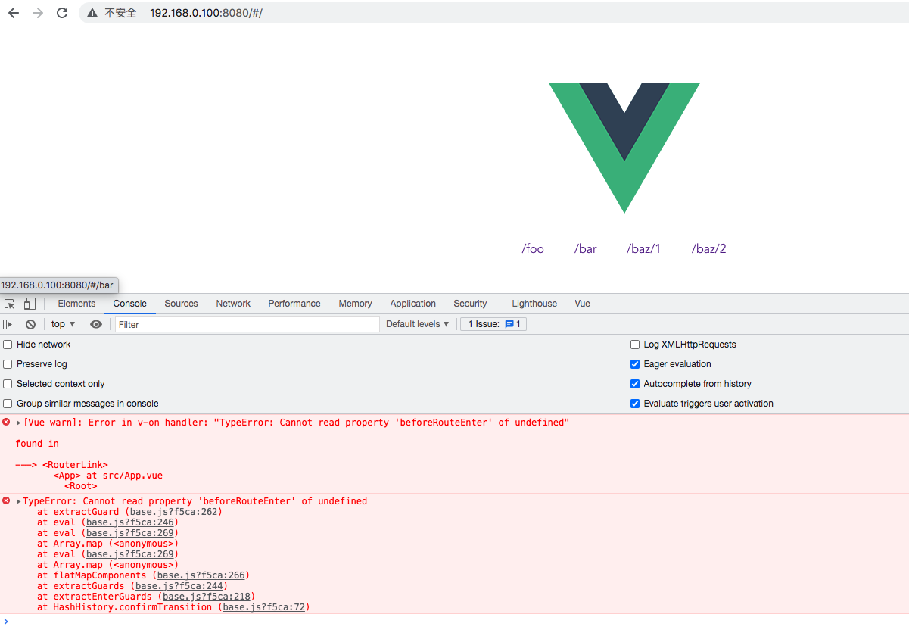
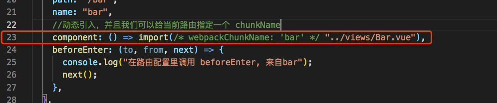
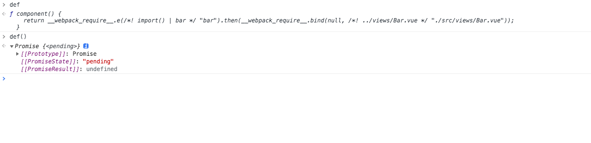
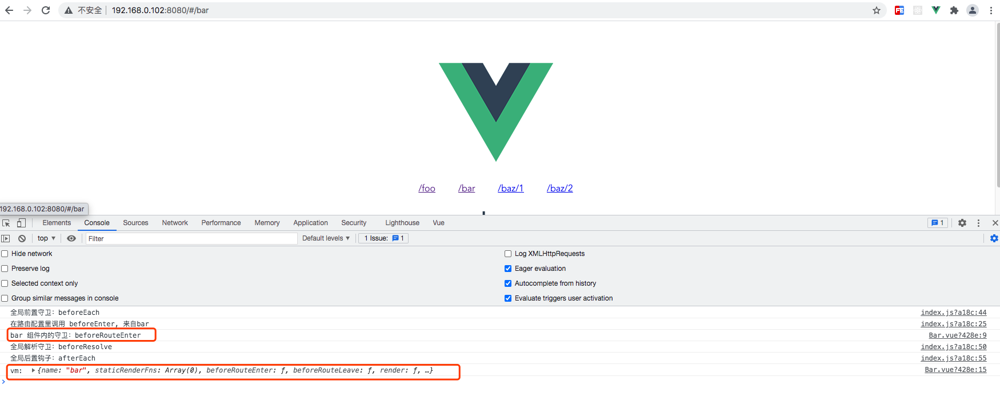

# 手写vue-router源码系列六：实现异步组件的导航守卫

这是我参与8月更文挑战的第6天，活动详情查看：[8月更文挑战](https://juejin.cn/post/6987962113788493831)

## 前言

上一个系列我们实现了路由导航，但是未能支持[异步组件](https://cn.vuejs.org/v2/guide/components-dynamic-async.html#%E5%BC%82%E6%AD%A5%E7%BB%84%E4%BB%B6)。这显然不够完美，接下来我们继续实现异步组件的导航守卫。

## 异步组件和路由懒加载的原理

在大型应用中，当打包构建应用时，JavaScript 包会变得非常大，影响页面加载。如果我们能把不同路由对应的组件分割成不同的代码块，然后当路由被访问的时候才加载对应组件，这样就更加高效了。

我们修改下路由配置，将bar组件动态引入。这样当我们导航到 bar 路由的时候。此时这个 bar 组件才会加载下来。
```js
{
  path: "/bar",
  name: "bar",
  //动态引入，并且我们可以给当前路由指定一个 chunkName
  component: () => import(/* webpackChunkName: 'bar' */ "../views/Bar.vue"),
  beforeEnter: (to, from, next) => {
    console.log("在路由配置里调用 beforeEnter, 来自bar");
    next();
  },
}
```
修改后的路由配置如下：

```js
// src/router/index.js

import Vue from "vue";
import VueRouter from "@/vRouter/";
import Foo from "../views/Foo.vue";
import Baz from "../views/Baz.vue";

Vue.use(VueRouter);

const routes = [
  {
    path: "/foo",
    name: "foo",
    component: Foo,
    beforeEnter: (to, from, next) => {
      console.log("在路由配置里调用 beforeEnter, 来自foo");
      next();
    },
  },
  {
    path: "/bar",
    name: "bar",
    //动态引入，并且我们可以给当前路由指定一个 chunkName
    component: () => import(/* webpackChunkName: 'bar' */ "../views/Bar.vue"),
    beforeEnter: (to, from, next) => {
      console.log("在路由配置里调用 beforeEnter, 来自bar");
      next();
    },
  },
  {
    path: "/baz/:id",
    component: Baz,
    beforeEnter: (to, from, next) => {
      console.log("在路由配置里调用 beforeEnter, 来自bar");
      next();
    },
  },
];

let router = new VueRouter({
  routes,
});

router.beforeEach((to, from, next) => {
  console.log("全局前置守卫：beforeEach");
  next();
});

router.beforeResolve((to, from, next) => {
  //在导航被确认之前，同时在所有组件内守卫和异步路由组件被解析之后，解析守卫就被调用。
  console.log("全局解析守卫：beforeResolve");
  next();
});

router.afterEach((to, from) => {
  console.log("全局后置钩子：afterEach");
});
export default router;

```

最后我们再来重启一下项目看看：



当我们点击 “/bar”,想要导航到 bar 组件的时候。控制台报错了并提示：TypeError: Cannot read property 'beforeRouteEnter' of undefined at extractGuard (base.js?f5ca:262)

这个报错是因为在我们执行 extractEnterGuards(activated) 的时候异步组件还没有被加载出来，也就是说这个时候的组件还是一个component函数(如下图所示)。因此无法通过 component.options[key] 拿到我们定义的 “beforeRouteEnter” 钩子。



## 分析 component: () => import("../views/Bar.vue") 到底是如何执行的

其实上述写法最终是返回了一个 Promise 的函数。如下图所示：

我们在路由配置中写的 component: () => import("../views/Bar.vue") 语法最终会被 webpack 执行并返回一个 Promise 函数。对异步组件不熟悉的建议看看官方文档：[异步组件](https://cn.vuejs.org/v2/guide/components-dynamic-async.html#%E5%BC%82%E6%AD%A5%E7%BB%84%E4%BB%B6)



**既然我们知道了使用这个路由懒加载的 component 最终给我们返回了一个 Promise 的函数那就好办了。我们只需要在这个 Promise 的状态变为 resolved 的时候就可以获取到这个组件实例对象。拿到了组件实例对象后我们就能够获取到 beforeRouteEnter 钩子函数了。**

## resolveAsyncComponents

如何从 component 的这个 Promise 函数中获取组件实例对象呢？

我们定义一个用于解析异步组件的方法，我们把它命名为 resolveAsyncComponents：

```js
//解析异步组件
function resolveAsyncComponents(matched) {
  return (to, from, next) => {
    let hasAsync = false;
    let error = null;

    flatMapComponents(matched, (def, _, match, key) => {
      // 首先利⽤了 flatMapComponents ⽅法从 matched 中获取到每个组件的定义。然后判断如果是异步组件，则执⾏异步组件加载逻辑。
      if (typeof def === "function" && def.cid === undefined) {
        hasAsync = true;

        const resolve = (resolvedDef) => {
          // resolve 返回的是一个 ES Module
          if (resolvedDef.__esModule) {
            resolvedDef = resolvedDef.default;
          }
          // 把解析好的异步组件放到对应的 components 上，并且执⾏ next 函数。
          match.components[key] = resolvedDef;
          next();
        };

        const reject = (reason) => {
          const msg = `Failed to resolve async component ${key}: ${reason}`;
          if (!error) {
            error = isError(reason) ? reason : new Error(msg);
            next(error);
          }
        };

        let res;
        try {
          // 执行这个Promise函数
          res = def(resolve, reject);
        } catch (e) {
          reject(e);
        }
        if (res) {
          // 如果有then方法则执行它
          if (typeof res.then === "function") {
            res.then(resolve, reject);
          }
        }
      }
    });

    if (!hasAsync) next();
  };
}
```

resolveAsyncComponents 返回的是⼀个导航守卫函数，有to 、from 、next 参数。在执行 runQueue方法的时候会执行到它。 这个导航守卫的内部利⽤了 flatMapComponents ⽅法从 matched 中获取到每个组件的定义，然后判断如果是异步组件，则执⾏异步组件的加载逻辑。

在执行异步组件的逻辑中我们定义了两个方法 resolve、reject。他们分别表示异步组件加载成功后的回调和加载事失败的回调。如果组件在载成功会把解析好的异步组件放到对应的 components 上，并且执⾏ next 函数。如果异步组件加载失败了，我们就调用next(error) 结束导航。

## 改造导航守卫队列

我们需要增加一个加载异步组件的队列：

```js
const queue = [].concat(
  // 从失活的路由提取 beforeRouteLeave 钩子
  extractLeaveGuards(deactivated),
  // 获取全局前置钩子
  this.router.beforeHooks,
  // 从重用的路由中提取 beforeRouteUpdate 钩子
  extractUpdateHooks(updated),
  // 从被激活的路由中提取 beforeEnter 钩子
  activated.map((m) => m.beforeEnter),
  // 加载异步组件
  resolveAsyncComponents(activated)
);
```
由于在执行完 queue 队列的时候我们才能获取到异步组件的实例，获取实例后才能获取定义在组件内的导航守卫钩子函数。因此我们还需要通过执行回调的方式来继续获取异步组件的导航守卫的定义。所以 runQueue 的执行过程需要改进一下：

```js
runQueue(queue, iterator, () => {
  // 提取 beforeRouteEnter 钩子
  const enterGuards = extractEnterGuards(activated);
  // 将 beforeRouteEnter 钩子数组与 beforeResolve 钩子数组连接起来组成新的队列
  const queue = enterGuards.concat(this.router.resolveHooks);
  // 等到异步组件加载完成之后再去执行一遍新的queue队列并且更新视图
  runQueue(queue, iterator, () => {
    onComplete && onComplete();
    if (this.router.app) {
      //当组件实例加载完成时候调用next的回调函数
      this.router.app.$nextTick(() => {
        //等待新组件被创建后执行handleRouteEntered函数，相当于执行 beforeRouteEnter 钩子
        handleRouteEntered(route);
      });
    }
  });
});
```

好了，改进后的 base.js 文件完整代码如下：

```js
// src/vRouter/history/base.js

import { START } from "../util/route";
import { inBrowser } from "../util/dom";
import { _Vue } from "../install";

export class History {
  constructor(router, base) {
    // 应用的基路径。例如，如果整个单页应用服务在 /app/ 下，然后 base 就应该设为 "/app/"。
    this.base = normalizeBase(base);
    this.router = router; //保存router实列
    this.current = START;
    this.listeners = [];
  }

  listen(cb) {
    //保存将来供 History 调用的方法
    this.cb = cb;
  }

  updateRoute(route) {
    this.current = route;
    this.cb && this.cb(route);
  }

  transitionTo(location, onComplete) {
    //计算目标route
    const route = this.router.match(location, this.current);
    const prev = this.current;
    this.confirmTransition(route, () => {
      //更新当前route
      this.updateRoute(route);
      onComplete && onComplete(route);
      this.ensureURL();
      //执行全局后置钩子
      this.router.afterHooks.forEach((hook) => {
        hook && hook(route, prev);
      });
    });
  }

  confirmTransition(route, onComplete) {
    const current = this.current;
    // updated 被重用的路由
    // activated 被激活的路由
    // deactivated 失活的路由

    const { updated, deactivated, activated } = resolveQueue(
      current.matched,
      route.matched
    );

    const queue = [].concat(
      // 从失活的路由提取 beforeRouteLeave 钩子
      extractLeaveGuards(deactivated),
      // 获取全局前置钩子
      this.router.beforeHooks,
      // 从重用的路由中提取 beforeRouteUpdate 钩子
      extractUpdateHooks(updated),
      // 从被激活的路由中提取 beforeEnter 钩子
      activated.map((m) => m.beforeEnter),
      // 解析异步路由
      resolveAsyncComponents(activated)
    );

    //这里的hook指的是我们的路由守卫钩子，只有执行next回调才会执行下一个钩子
    const iterator = (hook, next) => {
      try {
        //这个地方的hook就相当于我们自己定义的路由守卫： NavigationGuard(to, from, next)
        hook(route, current, (to) => {
          if (to === false) {
            this.ensureURL(true);
          } else if (isError(to)) {
            this.ensureURL(true);
          } else if (
            typeof to === "string" ||
            (typeof to === "object" &&
              (typeof to.path === "string" || typeof to.name === "string"))
          ) {
            if (typeof to === "object" && to.replace) {
              this.replace(to);
            } else {
              this.push(to);
            }
          } else {
            next(to);
          }
        });
      } catch (error) {
        console.log(error);
      }
    };

    runQueue(queue, iterator, () => {
      // 提取 beforeRouteEnter 钩子
      const enterGuards = extractEnterGuards(activated);
      // 将 beforeRouteEnter 钩子数组与 beforeResolve 钩子数组连接起来组成新的队列
      const queue = enterGuards.concat(this.router.resolveHooks);
      // 等到异步组件加载完成之后再去执行一遍新的queue队列并且更新视图
      runQueue(queue, iterator, () => {
        onComplete && onComplete();
        if (this.router.app) {
          //当组件实例加载完成时候调用next的回调函数
          this.router.app.$nextTick(() => {
            //等待新组件被创建后执行handleRouteEntered函数，相当于执行 beforeRouteEnter 钩子
            handleRouteEntered(route);
          });
        }
      });
    });
  }
}

function isError(err) {
  return Object.prototype.toString.call(err).indexOf("Error") > -1;
}

function normalizeBase(base) {
  if (!base) {
    if (inBrowser) {
      //如果在浏览器环境中会首先查找 <base href="" /> 中的href地址
      const baseEl = document.querySelector("base");
      base = (baseEl && baseEl.getAttribute("href")) || "/";
      //  "https://foo/" >> "/"
      base = base.replace(/^https?:\/\/[^\/]+/, "");
    } else {
      base = "/";
    }
  }
  //确保 base 以 "/" 开头
  if (base.charAt(0) !== "/") {
    base = "/" + base;
  }
  //去掉路径最后的 "/"
  return base.replace(/\/$/, "");
}

//序列化执行异步函数，只有执行next回调才会执行下一个钩子
function runQueue(queue, fn, cb) {
  const step = (index) => {
    if (index >= queue.length) {
      cb();
    } else {
      if (queue[index]) {
        fn(queue[index], () => {
          step(index + 1);
        });
      } else {
        step(index + 1);
      }
    }
  };
  step(0);
}

function resolveQueue(current, next) {
  let i;
  const max = Math.max(current.length, next.length);
  for (i = 0; i < max; i++) {
    if (current[i] !== next[i]) {
      break;
    }
  }
  return {
    updated: next.slice(0, i),
    activated: next.slice(i),
    deactivated: current.slice(i),
  };
}

/**
 * 将提取到的组件守卫钩子"绑定"到对应的组件实例上
 * @param {*} guard
 * @param {*} instance
 * @returns
 */
function bindGuard(guard, instance) {
  if (instance) {
    //const iterator = (hook, next) 中的 hook 就是 boundRouteGuard()
    return function boundRouteGuard() {
      return guard.apply(instance, arguments);
    };
  }
}

function bindEnterGuard(guard, match, key) {
  return function routeEnterGuard(to, from, next) {
    //guard => beforeRouteEnter
    //这里的cb就是我们平时在beforeRouteEnter的next中写的回调函数
    // next(vm => {
    //   通过 `vm` 访问组件实例
    //   console.log('vm: ', vm);
    // })
    return guard(to, from, (cb) => {
      if (typeof cb === "function") {
        if (!match.enteredCbs[key]) {
          match.enteredCbs[key] = [];
        }
        match.enteredCbs[key].push(cb);
      }
      next(cb);
    });
  };
}

//提取 beforeRouteEnter 钩子
function extractEnterGuards(activated) {
  return extractGuards(
    activated,
    "beforeRouteEnter",
    (guard, _, match, key) => {
      return bindEnterGuard(guard, match, key);
    }
  );
}

//提取 beforeRouteLeave 钩子
function extractLeaveGuards(deactivated) {
  return extractGuards(deactivated, "beforeRouteLeave", bindGuard, true);
}

//提取 beforeRouteUpdate 钩子
function extractUpdateHooks(updated) {
  return extractGuards(updated, "beforeRouteUpdate", bindGuard);
}

/**
 * extractGuards 最终会返回一个包含了对应 name 的组件路由守卫钩子组成的数组
 * bind => bindGuard(guard, instance)
 */
function extractGuards(records, name, bind, reverse) {
  // 循环records 再遍历每个records.record => {path: "/foo", regex: /^\/foo[\/#\?]?$/i, components: {…}, instances: {…}, beforeEnter: ƒ, …}
  // 这样就能拿到record.components.component 最终就是这个def，也就是我们写的.vue组件
  const guards = flatMapComponents(records, (def, instance, match, key) => {
    // 通过传入的.vue组件和路由守卫钩子名称就能获取到最终的钩子函数啦！
    const guard = extractGuard(def, name);
    if (guard) {
      return Array.isArray(guard)
        ? //这个 bind(guard, instance, match, key) 其实调用的就是 bindGuard(guard, instance, match, key) => guard.apply(instance, arguments)
          guard.map((guard) => bind(guard, instance, match, key))
        : bind(guard, instance, match, key);
    }
  });
  return flatten(reverse ? guards.reverse() : guards);
}

function extractGuard(def, key) {
  if (typeof def !== "function") {
    //使用基础 Vue 构造器，创建一个“子类”。参数是一个包含组件选项的对象。这样就可以通过 options[NavigationGuard] 获取到组件内对应的钩子函数了
    def = _Vue.extend(def);
  }
  return def.options[key];
}

//解析异步组件
function resolveAsyncComponents(matched) {
  return (to, from, next) => {
    let hasAsync = false;
    let error = null;

    flatMapComponents(matched, (def, _, match, key) => {
      // 首先利⽤了 flatMapComponents ⽅法从 matched 中获取到每个组件的定义。然后判断如果是异步组件，则执⾏异步组件加载逻辑。
      if (typeof def === "function" && def.cid === undefined) {
        hasAsync = true;

        const resolve = (resolvedDef) => {
          // resolve 返回的是一个 ES Module
          if (resolvedDef.__esModule) {
            resolvedDef = resolvedDef.default;
          }
          // 把解析好的异步组件放到对应的 components 上，并且执⾏ next 函数。
          match.components[key] = resolvedDef;
          next();
        };

        const reject = (reason) => {
          const msg = `Failed to resolve async component ${key}: ${reason}`;
          if (!error) {
            error = isError(reason) ? reason : new Error(msg);
            next(error);
          }
        };

        let res;
        try {
          // 执行这个Promise函数
          res = def(resolve, reject);
        } catch (e) {
          reject(e);
        }
        if (res) {
          // 如果有then方法则执行它
          if (typeof res.then === "function") {
            res.then(resolve, reject);
          }
        }
      }
    });

    if (!hasAsync) next();
  };
}

function flatMapComponents(matched, fn) {
  return flatten(
    matched.map((m) => {
      //遍历components里面的name，再依次执行fn(components.default, instances, components, 'default')
      return Object.keys(m.components).map((key) =>
        fn(m.components[key], m.instances[key], m, key)
      );
    })
  );
}

function flatten(arr) {
  return Array.prototype.concat.apply([], arr);
}

//执行 beforeRouteEnter 钩子的函数
function handleRouteEntered(route) {
  for (let i = 0; i < route.matched.length; i++) {
    //从route.matched中获取路由记录
    const record = route.matched[i];
    //遍历record.instances
    for (const name in record.instances) {
      //获取组件
      const instance = record.instances[name];
      const cbs = record.enteredCbs[name];
      if (!instance || !cbs) {
        continue;
      }
      delete record.enteredCbs[name];
      for (let i = 0; i < cbs.length; i++) {
        if (!instance._isBeingDestroyed) {
          //如果组件没有被销毁就执行 beforeRouteEnter 里面的next(vm => { //通过 `vm` 访问组件实例 console.log('vm: ', vm);}) 方法传入的回调函数，参数是当前组件实例。
          //所以官方文档说在beforeRouteEnter 守卫不能访问this，但是可以通过传一个回调给next来访问组件实例。
          cbs[i](instance);
        }
      }
    }
  }
}
```
最后我们再运行项目后切换到 http://localhost:8080/#/bar 路径看看控制台输出：



由截图看出异步组件成功的被加载且执行了 bar 组件的导航守卫钩子。

## 总结完整的导航解析流程

1. 导航被触发。
2. 在失活的组件里调用 beforeRouteLeave 守卫。
3. 调用全局的 beforeEach 守卫。
4. 在重用的组件里调用 beforeRouteUpdate 守卫 (2.2+)。
5. 在路由配置里调用 beforeEnter。
6. 解析异步路由组件。
7. 在被激活的组件里调用 beforeRouteEnter。
8. 调用全局的 beforeResolve 守卫 (2.5+)。
9. 导航被确认。
10. 调用全局的 afterEach 钩子。
11. 触发 DOM 更新。
12. 调用 beforeRouteEnter 守卫中传给 next 的回调函数，创建好的组件实例会作为回调函数的参数传入。

## 感谢

vue-router 源码的手写教程系列一共分为6个系列，从介绍 VueRouter 类的实现到路由匹配再到路由组件实现最后再介绍完整的路由导航解析。这6个系列是笔者下班回到家熬夜肝出来的，有时候工作繁忙但也不敢停止更文的步伐，一是不想让我的读者朋友们失望。再就是对自己负责，在掘金记录自己的点滴心得也是一件辛事。我在这里对我的读者朋友和粉丝们表示由衷的感谢！

## Vue-Router 源码相关系列链接：

- [手写Vue Router源码系列一： 实现 VueRouter](https://juejin.cn/post/6991348164527685640)
- [手写Vue Router源码系列二：实现 matcher](https://juejin.cn/post/6993155485775953951)
- [手写vue-router源码系列三：实现改变hash后更新视图](https://juejin.cn/post/6994722379553308685)
- [手写vue-router源码系列四：实现全局组件 router-link、router-view](https://juejin.cn/post/6995956430310211598)
- [手写vue-router源码系列五：实现导航守卫](https://juejin.cn/post/7000307389878501384)